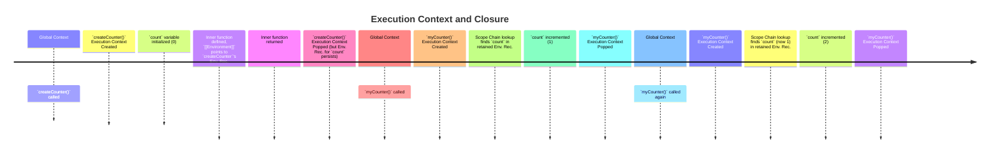

### 1. What is a Closure in JavaScript?

A closure in JavaScript is a function that remembers its **lexical environment** even after the outer function has finished executing. This means an inner function can still access variables from its containing (outer) function's scope, even if the outer function has already returned.

* **Difference between an inner function and a closure:**
    * An **inner function** is simply a function defined inside another function.
    * A **closure** is an inner function that *retains access* to the outer function's scope *after* the outer function has completed its execution and its execution context has been popped off the call stack. The "closure" is the combination of the inner function and the lexical environment it "closes over."

* **One-liner syntax + step-by-step explanation using real code:**

    ```javascript
    function createGreeter(greeting) { // Outer function
      return function(name) {         // Inner function (forms a closure)
        console.log(`${greeting}, ${name}!`);
      };
    }

    const sayHello = createGreeter("Hello"); // Step 1: Call outer function
    sayHello("Alice");                       // Step 2: Call inner function
    // Output: Hello, Alice!
    ```

    **Step-by-step Explanation:**
    1.  `createGreeter("Hello")` is called. A new **execution context** for `createGreeter` is created.
    2.  Inside `createGreeter`, a local variable `greeting` is set to "Hello".
    3.  An anonymous inner function `function(name) { ... }` is *defined* and returned.
    4.  Crucially, this inner function "remembers" the `greeting` variable from its surrounding scope (`createGreeter`'s lexical environment). This "remembering" is the essence of a closure.
    5.  The `createGreeter` function finishes execution, and its execution context is *popped off the call stack*.
    6.  The returned inner function is assigned to `sayHello`.
    7.  When `sayHello("Alice")` is called, a new execution context for this inner function is created.
    8.  Despite `createGreeter` no longer being active on the call stack, the inner function `sayHello` can *still access* the `greeting` variable ("Hello") because it's part of its preserved lexical environment.

---

### 2. Why Do Closures Exist?

Closures are a direct consequence of JavaScript's **lexical scoping** (also known as static scoping).

* **Lexical Scope and Environment Record:**
    * **Lexical Scope:** In JavaScript, the scope of a variable is determined by *where* it is defined in the source code, not *where* it is called. This means that a function's inner scope can always access its outer (enclosing) scope.
    * **Environment Record:** Every execution context has an associated **Environment Record**, which is a conceptual object that stores all the variable and function declarations within that scope. When an inner function is defined, it gets an internal `[[Environment]]` property that links it to the Environment Record of its parent scope at the time of its *creation*. This link is what allows the inner function to "remember" its outer variables.

* **How closures let inner functions access outer variables after the outer function returns:**
    When the outer function's execution context is popped off the call stack, its variables would normally be marked for garbage collection. However, if an inner function (that forms a closure) still holds a reference to that outer scope's Environment Record, that Environment Record (or at least the variables it contains that are referenced by the inner function) will *not* be garbage collected. It persists in memory, allowing the inner function to access those variables later.

* **Benefits:**
    * **Data Hiding (Encapsulation/Private State):** Closures allow you to create "private" variables that are not directly accessible from the outside. Only the functions within the closure can access or modify them, leading to cleaner, more robust code and preventing accidental modifications. This is foundational for patterns like the Module Pattern.
    * **State Management:** Closures can maintain state between multiple calls to a function, as seen in counter functions or iterators. The state is "closed over" and persists across invocations.
    * **Memory Efficiency (Selective Retention):** While closures can cause memory issues if not managed, they also allow for selective retention. Only the necessary parts of the outer environment are kept in memory, not the entire execution context.
    * **API Design:** Closures are fundamental for designing flexible and powerful APIs, enabling techniques like currying, partial application, and creating functions that are configurable or remember specific settings.

---

### 3. Internal Working of Closures (Memory, Scope, Context)

Let's trace the lifecycle and internal mechanisms of a closure.

**Breakdown of:**

* **Memory Creation Phase (during parsing/compilation):**
    When the JavaScript engine encounters a function definition, it doesn't immediately execute the code. Instead, it creates an `Environment Record` for that function (or its surrounding scope) and attaches an internal `[[Environment]]` property to the function object. This `[[Environment]]` property points to the `Environment Record` of the scope in which the function was *defined* (its lexical environment). This is crucial: the link is established at definition time, not execution time.

* **Execution Phase (during runtime):**
    1.  **Function Call:** When a function is called, a new **Execution Context** is created for it and pushed onto the **Call Stack**.
    2.  **Lexical Environment Creation:** This new execution context gets its own Lexical Environment. This Lexical Environment consists of:
        * Its own **Environment Record** (for local variables and arguments).
        * A reference to its **outer lexical environment** (`outer lexical environment reference`). This reference is taken from the `[[Environment]]` property of the function that was just called. This forms the **Scope Chain**.
    3.  **Variable Resolution:** When a variable is accessed within the function, the JavaScript engine first looks in the current Environment Record. If not found, it moves up the `outer lexical environment reference` chain, checking each parent's Environment Record until the variable is found or the global scope is reached.

* **Scope Chain Lookup:**
    The scope chain is a hierarchical lookup mechanism. When code inside a function needs to resolve a variable, it first looks within its own `Environment Record`. If the variable isn't found there, it then looks in the `Environment Record` of its immediate `outer lexical environment`, and so on, until it reaches the global `Environment Record`. This chain is established at function definition time (lexical scoping).

* **Internals of Execution Context and Closure Reference Formation:**
    When an inner function is returned and assigned to a variable *outside* its defining outer function, the inner function carries its `[[Environment]]` property with it. This `[[Environment]]` property points to the `Environment Record` of its outer function. Even after the outer function's execution context is removed from the Call Stack, if this `Environment Record` is referenced by the `[[Environment]]` of the returned inner function, it will **not be garbage collected**. This persistent link ensures the inner function can still access the "closed over" variables. This is how the "closure" is formed and maintained.

---

**ASCII / Markdown Diagrams:**

**Scope Chain (Conceptual)**

```
  Global Execution Context
  +-----------------------+
  | Environment Record:   |
  |   - globalVar         |
  +-----------------------+
              |
              V
  OuterFunction Execution Context
  +-----------------------+
  | Environment Record:   |
  |   - outerVar          |
  |   - innerFunc         |  <--- innerFunc's [[Environment]] points here
  +-----------------------+
              |
              V
  InnerFunction Execution Context
  +-----------------------+
  | Environment Record:   |
  |   - innerVar          |
  +-----------------------+
```

**Call Stack + Heap Interaction (Closure Lifecycle)**

```
                                Heap
                          +-----------------+
                          | Environment Rec |
                          | for createCount |
                          |   - count: 0    |  <--- Referenced by `counter`
                          +-----------------+
                                  ^
                                  |
Call Stack                      |
+---------------------+         |
|                     |         |
| counter()           |         |
| (exec context for   |         |
|  inner function)    |         |
|                     |         |
+---------------------+         |
|                     |         |
| <empty>             |         |
|                     |         |
+---------------------+         |
|                     |         |
| createCounter()     |         |  <-- Popped off, but its Env. Rec. persists
| (exec context)      |         |      because `innerFunc` holds a ref.
|                     |         |
+---------------------+         |
| Global()            |         |
| (exec context)      |         |
|                     |         |
+---------------------+         |
```

**Closure Lifecycle:**

```
  1. Function Definition:
     Inner function is created. Its [[Environment]]
     property is set to the Lexical Environment
     of its defining (outer) scope.

  2. Outer Function Execution:
     Outer function is called, its Execution Context
     is pushed onto the Call Stack.

  3. Inner Function Return:
     Inner function is returned. The *reference*
     to this inner function (which carries its
     [[Environment]] link) is passed out.

  4. Outer Function Finishes:
     Outer function's Execution Context is popped
     from the Call Stack. Its local variables
     would normally be eligible for GC.

  5. Closure Formation/Retention:
     If the returned inner function (now a closure)
     is stored somewhere (e.g., a variable, an array),
     its [[Environment]] link *prevents* the referenced
     outer scope's Environment Record (and relevant variables)
     from being garbage collected. This is the closure.

  6. Inner Function Invocation:
     When the closure is later invoked, a new Execution
     Context for it is created. Its Scope Chain includes
     the retained outer Lexical Environment, allowing
     access to the "closed over" variables.

  7. Closure Release:
     When there are no more references to the closure itself,
     it becomes eligible for garbage collection, along with
     the Environment Record it was referencing.
```

---

### 4. Closure Examples (Progressively from Simple ➜ Advanced)

#### Counter function

This is the quintessential closure example demonstrating private state.

```javascript
function createCounter() {
  let count = 0; // 'count' is a private variable

  return function() { // This inner function forms the closure
    count++;
    console.log(count);
  };
}

const myCounter = createCounter();
myCounter(); // Output: 1 (count is 0 -> 1)
myCounter(); // Output: 2 (count is 1 -> 2)

const anotherCounter = createCounter(); // Creates a new, independent closure
anotherCounter(); // Output: 1
```

* **Explanation:** Each call to `createCounter()` creates a new `count` variable and a new inner function. The inner function returned by `myCounter` "closes over" *its own* `count`, independent of `anotherCounter`'s `count`.

#### Factory functions with private state

Creating objects with methods that access private data.

```javascript
function createPerson(name, initialAge) {
  let age = initialAge; // Private 'age' variable

  return {
    getName: function() {
      return name; // Accesses 'name' from outer scope
    },
    getAge: function() {
      return age; // Accesses private 'age'
    },
    celebrateBirthday: function() {
      age++; // Modifies private 'age'
      console.log(`${name} is now ${age} years old.`);
    }
  };
}

const alice = createPerson("Alice", 30);
console.log(alice.getName()); // Output: Alice
console.log(alice.getAge());  // Output: 30
alice.celebrateBirthday();    // Output: Alice is now 31 years old.
console.log(alice.getAge());  // Output: 31

// console.log(alice.age); // Undefined - 'age' is private
```

* **Explanation:** The methods `getName`, `getAge`, and `celebrateBirthday` all form closures over the `name` and `age` variables from the `createPerson` function's scope. This allows `age` to be truly private, only accessible via the returned methods.

#### Closure in loops: `var` vs `let`

Demonstrates the common `var` trap and how `let` (or closure) fixes it.

**`var` (The Pitfall):**

```javascript
console.log("--- var loop ---");
for (var i = 0; i < 3; i++) {
  setTimeout(function() {
    console.log(i); // What will this print?
  }, 100);
}
// Output (after 100ms delay):
// 3
// 3
// 3
```

* **Explanation:** When `var` is used, `i` is function-scoped (or global in this case). By the time `setTimeout`'s callback executes, the loop has already finished, and `i` has been incremented to `3`. All three closures (the callbacks) share the *same* `i` variable from the same outer scope, and they all reference its final value.

**`let` (The Fix):**

```javascript
console.log("--- let loop ---");
for (let j = 0; j < 3; j++) {
  setTimeout(function() {
    console.log(j); // What will this print?
  }, 100);
}
// Output (after 100ms delay):
// 0
// 1
// 2
```

* **Explanation:** When `let` is used, `j` is block-scoped. Crucially, in each iteration of the `for` loop with `let`, a *new block scope* is created, and a *new `j` variable* is bound to that scope. Each `setTimeout` callback forms a closure over *its own specific `j`* from *that particular iteration's block scope*.

#### `setTimeout()` inside loop and how to fix (pre-`let`)

Using an IIFE to create a new scope for `var`.

```javascript
console.log("--- setTimeout with IIFE fix ---");
for (var k = 0; k < 3; k++) {
  (function(capturedK) { // Immediately Invoked Function Expression (IIFE)
    setTimeout(function() {
      console.log(capturedK);
    }, 100);
  })(k); // Pass 'k' as an argument to the IIFE
}
// Output (after 100ms delay):
// 0
// 1
// 2
```

* **Explanation:** The IIFE immediately executes in each iteration. It receives the *current value* of `k` as `capturedK`. The `setTimeout` callback then forms a closure over this `capturedK` from the IIFE's scope, effectively "capturing" the value for each iteration.

#### IIFE closures

IIFEs themselves create closures to achieve data privacy.

```javascript
const calculator = (function() { // Outer IIFE
  let result = 0; // Private state

  function add(num) {
    result += num;
    return result;
  }

  function subtract(num) {
    result -= num;
    return result;
  }

  return { // Public API
    add: add,
    subtract: subtract,
    getCurrentResult: function() {
      return result; // Closure over 'result'
    }
  };
})(); // Immediately invoked

console.log(calculator.add(5));          // Output: 5
console.log(calculator.add(3));          // Output: 8
console.log(calculator.subtract(2));     // Output: 6
console.log(calculator.getCurrentResult()); // Output: 6
// console.log(calculator.result); // Undefined - 'result' is private
```

* **Explanation:** The `add`, `subtract`, and `getCurrentResult` functions returned by the IIFE form closures over the `result` variable inside the IIFE's scope. This makes `result` effectively private.

#### Closures + Recursion

Closures can help maintain state across recursive calls without passing it explicitly as arguments in every call.

```javascript
function createFactorialCalculator() {
  const memo = {}; // Private cache for memoization

  function factorial(n) {
    if (n in memo) {
      console.log(`Getting factorial(${n}) from cache`);
      return memo[n];
    }
    if (n === 0 || n === 1) {
      return 1;
    }
    const result = n * factorial(n - 1);
    memo[n] = result; // Store in cache
    return result;
  }
  return factorial; // Return the function that has access to 'memo'
}

const calcFactorial = createFactorialCalculator();
console.log(calcFactorial(5)); // Calculates 5*4*3*2*1
console.log(calcFactorial(3)); // Gets 3 from cache if 5 was calculated
console.log(calcFactorial(5)); // Gets from cache
```

* **Explanation:** The `factorial` function forms a closure over the `memo` object. This `memo` object persists across all recursive calls within a single `calcFactorial` instance, effectively enabling memoization.

#### Closures + Arrow functions (`this` binding)

Arrow functions lexically bind `this`, making them useful in closures where `this` might otherwise be re-bound.

```javascript
function createTimer() {
  this.delay = 1000; // 'this' refers to the object calling createTimer

  return {
    start: function() {
      // In traditional function, 'this' here would refer to the start object.
      // We need to capture 'this' or use an arrow function.
      setTimeout(() => { // Arrow function lexically binds 'this'
        console.log(`Timer started with delay: ${this.delay}ms`);
      }, this.delay);
    }
  };
}

const timer = createTimer.call({ delay: 500 }); // Explicitly set 'this' for createTimer
timer.start(); // Output: Timer started with delay: 500ms (after 500ms)
```

* **Explanation:** The arrow function `() => { ... }` within `start` does not have its own `this` context. Instead, it captures `this` from its surrounding lexical scope, which in this case is the `start` method's `this` (which then points to the object returned by `createTimer`). If `createTimer` was called as `new createTimer()`, `this.delay` would refer to the instance property. The key is that the arrow function preserves the `this` from the *enclosing function's definition scope*.

---

### 5. Real-World Use Cases

Closures are pervasive in modern JavaScript development.

#### Module Pattern for data hiding

The classic way to emulate private methods and properties before ES6 Modules.

```javascript
const ShoppingCart = (function() {
  let items = []; // Private array

  function findItem(name) {
    return items.find(item => item.name === name);
  }

  return { // Public API
    addItem: function(name, price) {
      if (findItem(name)) {
        console.log(`${name} already in cart.`);
        return;
      }
      items.push({ name, price });
      console.log(`${name} added.`);
    },
    removeItem: function(name) {
      const index = items.findIndex(item => item.name === name);
      if (index > -1) {
        items.splice(index, 1);
        console.log(`${name} removed.`);
      } else {
        console.log(`${name} not found.`);
      }
    },
    getTotal: function() {
      return items.reduce((total, item) => total + item.price, 0);
    },
    getCartContents: function() {
      // Return a shallow copy to prevent external modification of the array itself
      return [...items];
    }
  };
})();

ShoppingCart.addItem("Laptop", 1200);
ShoppingCart.addItem("Mouse", 25);
ShoppingCart.addItem("Laptop", 1200); // Output: Laptop already in cart.
console.log("Cart total:", ShoppingCart.getTotal()); // Output: Cart total: 1225
console.log("Cart contents:", ShoppingCart.getCartContents());
// console.log(ShoppingCart.items); // Undefined - 'items' is private
```

* **Explanation:** The `items` array and `findItem` function are private to the `ShoppingCart` module. The returned object's methods are closures that can access and modify `items`, but `items` itself is not exposed globally.

#### Currying and Partial Application

Transforming a function that takes multiple arguments into a sequence of functions, each taking a single argument.

```javascript
function multiply(a) {
  return function(b) { // Inner closure
    return function(c) { // Another inner closure
      return a * b * c;
    };
  };
}

const multiplyBy5 = multiply(5); // Partial application: 'a' is fixed
const multiplyBy5and10 = multiplyBy5(10); // Partial application: 'a' and 'b' are fixed
console.log(multiplyBy5and10(2)); // Output: 100 (5 * 10 * 2)

const curriedMultiply = a => b => c => a * b * c; // Arrow function currying
console.log(curriedMultiply(2)(3)(4)); // Output: 24
```

* **Explanation:** Each returned function forms a closure over the arguments passed to the preceding function, "remembering" them for subsequent calls.

#### Memoization techniques

Caching the results of expensive function calls to improve performance.

```javascript
function memoize(fn) {
  const cache = {}; // Private cache for the memoized function

  return function(...args) { // Closure over 'cache'
    const key = JSON.stringify(args); // Simple key for arguments
    if (cache[key]) {
      console.log(`Fetching from cache for args: ${key}`);
      return cache[key];
    } else {
      console.log(`Calculating for args: ${key}`);
      const result = fn(...args);
      cache[key] = result;
      return result;
    }
  };
}

const expensiveCalculation = (num1, num2) => {
  // Simulate heavy computation
  for (let i = 0; i < 1000000; i++) {}
  return num1 + num2;
};

const memoizedAdd = memoize(expensiveCalculation);

console.log(memoizedAdd(10, 20)); // Calculating... Output: 30
console.log(memoizedAdd(10, 20)); // Fetching from cache... Output: 30
console.log(memoizedAdd(5, 7));   // Calculating... Output: 12
```

* **Explanation:** The `memoize` higher-order function returns a new function (a closure) that "closes over" its own `cache` object. This `cache` persists across calls to the memoized function, allowing it to store and retrieve previously computed results.

#### Preserving state in Event Handlers

Ensuring the correct data is available when an event fires.

```javascript
function createButtonHandler(buttonId) {
  let clickCount = 0; // Private state for each button handler

  document.getElementById(buttonId).addEventListener('click', function() {
    clickCount++;
    console.log(`Button ${buttonId} clicked ${clickCount} times.`);
    // 'this' inside event listener generally refers to the element itself
  });
}

// Assume HTML has: <button id="btn1">Button 1</button> <button id="btn2">Button 2</button>
// createButtonHandler("btn1");
// createButtonHandler("btn2");
```

* **Explanation:** Each call to `createButtonHandler` creates a unique `clickCount` variable and an event listener function. The event listener forms a closure over *its specific* `clickCount` and `buttonId`, ensuring independent state for each button.

#### Closures inside Custom Hooks (React)

Common pattern in React for stateful logic.

```javascript
// Example in a React-like custom hook context
function useCustomCounter(initialValue) {
  // `count` and `setCount` are state variables (managed by React)
  // `increment` and `decrement` are functions that form closures
  // over the current `count` and `setCount` from this hook's invocation.
  const [count, setCount] = React.useState(initialValue);

  const increment = React.useCallback(() => {
    // `setCount` here is from the outer scope of this `useCustomCounter` call
    setCount(prevCount => prevCount + 1);
  }, []); // [] dependency array means increment function identity is stable

  const decrement = React.useCallback(() => {
    setCount(prevCount => prevCount - 1);
  }, []);

  return { count, increment, decrement };
}

// Usage in a React component:
// function MyComponent() {
//   const { count, increment, decrement } = useCustomCounter(0);
//   return (
//     <div>
//       <p>Count: {count}</p>
//       <button onClick={increment}>Increment</button>
//       <button onClick={decrement}>Decrement</button>
//     </div>
//   );
// }
```

* **Explanation:** The `increment` and `decrement` functions are closures that "remember" the `setCount` function (and implicitly the `count` state) from the specific call to `useCustomCounter`. This allows them to update the correct state for that particular component instance. `useCallback` helps optimize by memoizing the functions themselves, but the underlying concept of closing over `setCount` is a closure.

#### Closures in async workflows

Capturing variables for use after an asynchronous operation completes.

```javascript
function fetchDataAndProcess(url) {
  let startTime = Date.now(); // Captured by the closure

  fetch(url)
    .then(response => response.json())
    .then(data => {
      // This anonymous function forms a closure over `url` and `startTime`
      let endTime = Date.now();
      console.log(`Data from ${url} fetched in ${endTime - startTime}ms.`);
      console.log("Processed data:", data);
    })
    .catch(error => {
      console.error(`Error fetching ${url}:`, error);
    });
}

fetchDataAndProcess("https://api.example.com/data/1"); // Replace with a real URL
// console.log("Request sent..."); // This line executes immediately
```

* **Explanation:** The `.then()` and `.catch()` callback functions are closures. They are executed asynchronously, potentially much later than `fetchDataAndProcess` finishes. Yet, they can still access `url` and `startTime` because they "closed over" these variables from their defining scope.

---

### 6. Closure Pitfalls + Common Gotchas

Understanding these is crucial for robust code.

#### Loop trap: `var` in loops (stale closures)

Revisiting the most common closure pitfall.

```javascript
// The Problem: All callbacks share the same 'i'
console.log("--- Loop trap with var ---");
const functions = [];
for (var i = 0; i < 3; i++) {
  functions.push(function() {
    console.log(i); // This 'i' will be 3 for all calls
  });
}
functions.forEach(f => f());
// Output:
// 3
// 3
// 3
```

* **Explanation:** The variable `i` declared with `var` is function-scoped (or global if not inside a function). All three anonymous functions pushed into the `functions` array close over the *same* `i`. By the time these functions are executed, the loop has completed, and `i` has its final value of `3`.

#### Closures retained in memory → potential leaks

If a closure is stored globally or on a DOM element, and it references a large object or an outer scope that itself contains large objects, those objects will not be garbage collected as long as the closure exists, leading to memory leaks.

```javascript
let largeData = new Array(1000000).fill('some_data'); // Large array

function createLeak() {
  const leakFunction = function() {
    console.log(largeData.length); // References largeData
  };
  // Storing leakFunction globally or on a DOM element will prevent largeData from being GC'd
  window.myLeak = leakFunction;
}

createLeak();
// Now, largeData is not eligible for garbage collection because window.myLeak holds a reference
// to its lexical environment.
// To fix: window.myLeak = null; // Dereference it explicitly
```

* **Explanation:** The `leakFunction` forms a closure over `largeData`. As long as `window.myLeak` exists, `largeData` will persist in memory.

#### Misconceptions:

* **❌ Closures copy values (false — they reference):**
    Closures do not copy the *values* of variables from their outer scope. Instead, they maintain a *reference* to the original variables themselves. If the outer variable's value changes, the closure will see the updated value.

    ```javascript
    function createUpdater() {
      let value = 10;
      const getter = function() { return value; }; // Closure over 'value'
      const setter = function(newValue) { value = newValue; };
      return { getter, setter };
    }

    const updater = createUpdater();
    console.log(updater.getter()); // Output: 10
    updater.setter(20);
    console.log(updater.getter()); // Output: 20 (demonstrates reference, not copy)
    ```

* **❌ Closures are always good (explain when not):**
    While powerful, closures can introduce overhead.
    * **Memory Overhead:** As seen, if not managed, they can lead to memory leaks by preventing variables from being garbage collected.
    * **Performance:** Creating many closures in a hot loop can introduce minor performance overhead due to the additional memory management and scope chain lookups.
    * **Complexity:** Over-reliance on deeply nested closures can make code harder to read, debug, and reason about.

#### How to debug and avoid these using DevTools / IIFE / `let`

* **DevTools:**
    * **Sources Tab:** Set breakpoints inside your closures.
    * **Scope Panel:** When execution pauses at a breakpoint, the "Scope" panel in browser DevTools (Chrome, Firefox) will show you the current `Local`, `Closure`, `Script`, and `Global` scopes. This allows you to inspect the variables that a closure has captured. This is your best friend for understanding what a closure *actually* sees.
    * **Memory Tab:** Use the "Memory" profiler to take heap snapshots and identify detached DOM elements or large objects retained by closures, helping to detect memory leaks.

* **IIFE / `let` for loop issues:**
    * **`let`:** Always prefer `let` (and `const`) over `var` in loops to avoid the closure-over-loop-variable trap, as `let` creates a new binding for each iteration.
    * **IIFE:** If you are in an environment where `let` is not available (e.g., very old JS engines) or you need to explicitly create a new scope for a `var` in an older codebase, use an IIFE (Immediately Invoked Function Expression) as demonstrated in Section 4.

---

### 7. Advanced Closure Patterns

#### Closures in Promises and `async/await`

Callbacks passed to `.then()`, `.catch()`, and the functions inside `async` functions inherently create closures.

```javascript
function loadUser(userId) {
  let startTime = Date.now(); // This variable is closed over by subsequent callbacks

  return fetch(`https://api.example.com/users/${userId}`)
    .then(response => {
      // Closure: Accesses `startTime` and `userId`
      if (!response.ok) {
        throw new Error(`HTTP error! Status: ${response.status}`);
      }
      return response.json();
    })
    .then(userData => {
      // Another closure: Accesses `startTime`, `userId`, and `userData`
      let loadTime = Date.now() - startTime;
      console.log(`User ${userId} loaded in ${loadTime}ms. Name: ${userData.name}`);
      return userData;
    })
    .catch(error => {
      // Closure: Accesses `startTime`, `userId`, and `error`
      console.error(`Failed to load user ${userId}. Error: ${error.message}`);
      throw error; // Re-throw to propagate the error
    });
}

// Example usage
// loadUser(123);
```

* **Explanation:** The anonymous arrow functions within `.then()` and `.catch()` are closures. They capture `startTime` and `userId` from the `loadUser` function's scope, ensuring these variables are available when the asynchronous operations complete, possibly much later. `async/await` essentially syntactic sugar over Promises, and the underlying closure behavior for capturing variables remains the same.

#### Closures + recursion for memoized DFS/BFS

As shown in section 4, memoization with closures is very effective for recursive algorithms like DFS/BFS, particularly on tree/graph problems.

```javascript
function createGraphPathFinder() {
  const visited = new Set(); // Private state for tracking visited nodes

  function dfs(graph, startNode, targetNode) {
    if (startNode === targetNode) {
      return [startNode];
    }
    visited.add(startNode);

    for (const neighbor of graph[startNode]) {
      if (!visited.has(neighbor)) {
        const path = dfs(graph, neighbor, targetNode);
        if (path) {
          return [startNode, ...path];
        }
      }
    }
    return null;
  }

  return dfs; // Returns DFS function that closes over 'visited'
}

// Example graph (adjacency list)
const graph = {
  A: ['B', 'C'],
  B: ['D'],
  C: ['E'],
  D: [],
  E: ['F'],
  F: []
};

const findPath = createGraphPathFinder();
console.log(findPath(graph, 'A', 'F')); // Output: [ 'A', 'C', 'E', 'F' ]

// If you call findPath again with the same instance, it might have stale 'visited' state.
// To re-use for a new path, you'd create a new finder:
// const findPath2 = createGraphPathFinder();
// console.log(findPath2(graph, 'A', 'D')); // Output: [ 'A', 'B', 'D' ]
```

* **Explanation:** The `dfs` function forms a closure over the `visited` Set. This allows `visited` to maintain its state across recursive calls without being passed explicitly as an argument, and to reset for different pathfinding tasks by creating a new `createGraphPathFinder` instance.

#### Using closures with `bind`, `call`, `apply`

These methods don't directly create closures, but they interact with function contexts, which often involve closures. `bind` is particularly relevant as it returns a new function (which can be a closure).

```javascript
const user = {
  name: "John Doe",
  greet: function(greeting) {
    console.log(`${greeting}, my name is ${this.name}`);
  }
};

const anonymousGreeter = user.greet;
// anonymousGreeter("Hi"); // Error: Cannot read property 'name' of undefined (if in strict mode)

// Using bind to create a new function (closure) with a fixed 'this'
const boundGreeter = user.greet.bind(user, "Hello"); // 'Hello' is partially applied
boundGreeter(); // Output: Hello, my name is John Doe

function createLogger(prefix) {
  return function(message) { // Closure over 'prefix'
    console.log(`${prefix}: ${message}`);
  }.bind(this); // 'this' here refers to the 'this' of createLogger's caller
}

const myObject = {
  logLevel: "INFO",
  logger: createLogger.call({ logLevel: "DEBUG" }, "App")
};

myObject.logger("Application started."); // Output: App: Application started. (if bound to App)
                                        // If this.logLevel was captured: DEBUG: Application started.
// Corrected to show closure for prefix and 'this' from createLogger:
function createFlexibleLogger(prefix) {
  // 'this' inside this outer function is defined by how createFlexibleLogger is called
  const contextLogger = function(message) {
    console.log(`${prefix} [${this.level || 'DEFAULT'}]: ${message}`);
  };
  return contextLogger;
}

const obj = { level: "ERROR" };
const errorLogger = createFlexibleLogger("Error Report").bind(obj);
errorLogger("Critical issue detected!"); // Output: Error Report [ERROR]: Critical issue detected!
```

* **Explanation:** `bind` returns a *new* function. This new function is essentially a closure that "remembers" the `this` context and any partially applied arguments passed to `bind`. It combines closure principles with explicit context binding.

#### Combining closures with functional programming (`map`, `filter`, `reduce`)

Higher-order functions often use callbacks that form closures over external variables.

```javascript
const students = [
  { name: "Alice", score: 85 },
  { name: "Bob", score: 92 },
  { name: "Charlie", score: 78 }
];

function createScoreFilter(minScore) {
  return function(student) { // Closure over `minScore`
    return student.score >= minScore;
  };
}

const passedStudents = students.filter(createScoreFilter(80));
console.log(passedStudents);
// Output: [ { name: 'Alice', score: 85 }, { name: 'Bob', score: 92 } ]

function createScoreFormatter(prefix, suffix) {
  return function(student) { // Closure over `prefix` and `suffix`
    return `${prefix}${student.name}: ${student.score}${suffix}`;
  };
}

const formattedScores = students.map(createScoreFormatter("Student ", " points."));
console.log(formattedScores);
// Output:
// [
//   'Student Alice: 85 points.',
//   'Student Bob: 92 points.',
//   'Student Charlie: 78 points.'
// ]
```

* **Explanation:** The anonymous functions passed to `filter` and `map` are closures. They capture `minScore` and `prefix`/`suffix` respectively, allowing them to perform their operations based on these configured values.

#### Closures in `setInterval` and event delegation

Similar to `setTimeout`, `setInterval` callbacks also form closures. Event delegation often uses closures to access specific data for the delegated event.

```javascript
function startPolling(url, interval) {
  let counter = 0; // Private state for this polling instance

  const intervalId = setInterval(() => { // Closure over `url`, `interval`, `counter`
    counter++;
    console.log(`Polling ${url}, iteration ${counter}`);
    fetch(url).then(response => response.json()).then(data => {
      // Process data
    });
    if (counter >= 5) {
      clearInterval(intervalId); // Stop after 5 iterations
      console.log(`Stopped polling ${url}`);
    }
  }, interval);
}

// startPolling("https://api.example.com/status", 2000); // Poll every 2 seconds

// Event Delegation with Closure
// Assume <ul id="myList"><li>Item 1</li><li>Item 2</li></ul>
// document.getElementById('myList').addEventListener('click', function(event) {
//   if (event.target.tagName === 'LI') {
//     const clickedItemText = event.target.textContent; // Captured for potential future use
//     // This anonymous function forms a closure over 'event.target'
//     // and potentially other variables from the outer scope of this listener.
//     console.log(`Clicked on: ${clickedItemText}`);
//     // For example, if you wanted to fire another async event after 1s based on this:
//     setTimeout(() => {
//       console.log(`Delayed action for ${clickedItemText}`);
//     }, 1000);
//   }
// });
```

* **Explanation:** The callback function for `setInterval` forms a closure over `url`, `interval`, and `counter`, allowing it to maintain the polling state. In event delegation, the event listener itself is a closure that can access variables from its surrounding scope, including the `event` object and properties derived from it, even after the initial event handling function completes.

#### Memory overhead and cleanup

As discussed in pitfalls, awareness of memory retention is key.
* **Best Practice:** When a closure is no longer needed (e.g., an event listener for a removed DOM element, or a polling function that is stopped), ensure you explicitly remove all references to it to allow garbage collection.
    * For `setInterval`/`setTimeout`: use `clearInterval`/`clearTimeout`.
    * For event listeners: use `removeEventListener`.
    * For objects: set variables to `null` or `undefined` when they are no longer in use, especially for global references.

---

### 8. Interview-Level Closure Challenges

#### Challenge 1: Code + Prediction (Counter with Reset)

```javascript
function createResettableCounter() {
  let count = 0;
  return {
    increment: function() {
      count++;
      return count;
    },
    reset: function() {
      count = 0;
      return count;
    }
  };
}

const counter1 = createResettableCounter();
console.log(counter1.increment());
console.log(counter1.increment());
const counter2 = createResettableCounter();
console.log(counter2.increment());
console.log(counter1.reset());
console.log(counter1.increment());
console.log(counter2.increment());
```

* **Prediction:**
    * `counter1.increment()`: 1
    * `counter1.increment()`: 2
    * `counter2.increment()`: 1 (Independent counter)
    * `counter1.reset()`: 0 (Resets `counter1`'s private `count`)
    * `counter1.increment()`: 1 (Increments `counter1`'s `count` from 0)
    * `counter2.increment()`: 2 (Increments `counter2`'s `count` from 1)

* **Output Trace:**
    ```
    1
    2
    1
    0
    1
    2
    ```

* **Call Stack + Closure Reference Diagram (for `counter1.increment()` after `counter1.reset()`):**

    ```
    Call Stack                            Heap
    +---------------------+         +---------------------+
    |                     |         | Environment Record  |
    | counter1.increment()|         | for createResettableCounter |
    | (exec context)      |         |   - count: 1        | <--- Referenced by increment, reset
    |   - outer: EnvRec_CRC|---------> +---------------------+
    +---------------------+
    |                     |
    | console.log()       |
    | (exec context)      |
    +---------------------+
    |                     |
    | Global()            |
    | (exec context)      |
    +---------------------+
    ```

* **Interview-style Explanation:**
    "The `createResettableCounter` function acts as a factory, creating independent counter instances. Each instance has its own `count` variable, which is declared with `let` and exists within the lexical environment of its `createResettableCounter` call. The `increment` and `reset` methods returned are closures; they 'close over' and maintain a reference to *their specific* `count` variable. When `counter1.reset()` is called, it modifies `counter1`'s private `count` to `0` without affecting `counter2`'s separate `count`. This demonstrates effective data encapsulation using closures."

#### Challenge 2: Memory Retention Tracing (Large Array Cleanup)

```javascript
let globalRef = null;

function createDataProcessor() {
  let data = new Array(100000).fill('some_heavy_data');
  const process = function(item) {
    // Simulate processing using data
    console.log(`Processing item: ${item}, data length: ${data.length}`);
  };

  // We expose process, but it holds a reference to 'data'
  // globalRef = process; // Potential leak if uncommented

  return process; // Returning the closure
}

let processorInstance = createDataProcessor();
processorInstance("A");
processorInstance = null; // What happens to 'data' now?
```

* **Prediction:**
    When `processorInstance = null;` is executed, the *only* remaining reference to the `process` closure (and thus the `data` variable it closed over) is removed. The `process` closure and the `data` array it referenced become eligible for garbage collection.

* **Memory Retention Tracing:**
    1.  `createDataProcessor` is called.
    2.  `data` (large array) and `process` function are created in `createDataProcessor`'s lexical environment.
    3.  `process`'s `[[Environment]]` points to `createDataProcessor`'s environment record, which contains `data`.
    4.  `process` is returned and assigned to `processorInstance`. `processorInstance` now holds the *only* external reference to this closure.
    5.  `processorInstance("A")` is called; `process` accesses `data`.
    6.  `processorInstance = null;` removes the reference to the `process` closure.
    7.  Since no other references to `process` (and therefore to the `createDataProcessor`'s lexical environment and `data`) exist, the JavaScript engine's garbage collector can now reclaim the memory occupied by `process` and `data`.

* **Interview-style Explanation:**
    "Here, `createDataProcessor` defines a large `data` array. The `process` function forms a closure over this `data` array. Initially, `data` is retained in memory because `processorInstance` holds a reference to the `process` closure. When `processorInstance = null;` is executed, the direct reference to the closure is severed. As there are no other active references to that specific closure instance or its lexical environment (including `data`), the garbage collector can identify `data` as unreachable and reclaim its memory. This demonstrates proper cleanup and avoiding memory leaks when closures are no longer needed."

#### Challenge 3: Debugging Closure-Related Bugs (Async Loop Bug)

```javascript
console.log("Challenge 3:");
function runTasks() {
  for (var i = 1; i <= 3; i++) {
    setTimeout(function() {
      console.log(`Task ${i} completed.`);
    }, i * 100);
  }
}
runTasks();
```

* **Prediction:**
    This will print `Task 4 completed.` three times, each after 100ms, 200ms, and 300ms respectively.

* **Output Trace:**
    ```
    (after 100ms) Task 4 completed.
    (after 200ms) Task 4 completed.
    (after 300ms) Task 4 completed.
    ```

* **Debugging Closure-Related Bugs + Fix:**
    **Bug:** The `var` declaration for `i` makes `i` function-scoped (or global). By the time any `setTimeout` callback executes, the loop has completed, and `i` has incremented to `4`. All three closures (the callbacks) share a reference to this single, final `i`.

    **Fix (using `let`):**
    ```javascript
    console.log("Challenge 3 - Fixed with let:");
    function runTasksFixed() {
      for (let i = 1; i <= 3; i++) { // Change var to let
        setTimeout(function() {
          console.log(`Task ${i} completed.`);
        }, i * 100);
      }
    }
    runTasksFixed();
    // Output:
    // (after 100ms) Task 1 completed.
    // (after 200ms) Task 2 completed.
    // (after 300ms) Task 3 completed.
    ```
    * **Explanation:** With `let`, a new `i` is bound to each iteration of the loop's block scope. Each `setTimeout` callback closes over its unique `i` for that specific iteration.

    **Fix (using IIFE for older environments):**
    ```javascript
    console.log("Challenge 3 - Fixed with IIFE:");
    function runTasksFixedIIFE() {
      for (var i = 1; i <= 3; i++) {
        (function(capturedI) { // IIFE creates a new scope for each iteration
          setTimeout(function() {
            console.log(`Task ${capturedI} completed.`);
          }, capturedI * 100);
        })(i); // Pass current 'i' into the IIFE's scope
      }
    }
    runTasksFixedIIFE();
    // Output: (same as 'let' fix)
    // (after 100ms) Task 1 completed.
    // (after 200ms) Task 2 completed.
    // (after 300ms) Task 3 completed.
    ```

#### Challenge 4: `once()` function

Implement a function `once` that takes another function as an argument and returns a new function. The returned function, when called, will execute the original function only once. Subsequent calls should return the result of the first execution without re-executing the original function.

```javascript
function once(func) {
  let hasBeenCalled = false;
  let result;

  return function(...args) { // This is the closure
    if (!hasBeenCalled) {
      hasBeenCalled = true;
      result = func(...args);
    }
    return result;
  };
}

const greetOnce = once((name) => {
  console.log(`Greeting ${name} for the first time!`);
  return `Hello, ${name}!`;
});

console.log(greetOnce("Alice"));
console.log(greetOnce("Bob")); // This should not print 'Greeting Bob...'
console.log(greetOnce("Charlie"));
```

* **Prediction:**
    * `Greeting Alice for the first time!` will be printed.
    * `Hello, Alice!`
    * `Hello, Alice!`
    * `Hello, Alice!`

* **Output Trace:**
    ```
    Greeting Alice for the first time!
    Hello, Alice!
    Hello, Alice!
    Hello, Alice!
    ```

* **Call Stack + Closure Reference Diagram (after first call to `greetOnce`):**
    ```
    Call Stack                            Heap
    +---------------------+         +---------------------+
    |                     |         | Environment Record  |
    | <empty>             |         | for once()          |
    |                     |         |   - hasBeenCalled: true | <--- Referenced by returned function
    +---------------------+         |   - result: "Hello, Alice!" |
    | Global()            |         |---------------------|
    | (exec context)      |         | func (original func)|
    |   - greetOnce: fn() |---------> (returned by once)  |
    +---------------------+         +---------------------+
    ```

* **Interview-style Explanation:**
    "The `once` function creates and returns a new function. This new function forms a closure over `hasBeenCalled` and `result` from `once`'s scope. These variables act as private state. The first time the returned function is invoked, `hasBeenCalled` is `false`, so the original `func` executes, `hasBeenCalled` is set to `true`, and its `result` is stored. For all subsequent calls, `hasBeenCalled` is `true`, so the original `func` is skipped, and the previously stored `result` is returned. This effectively ensures the wrapped function runs only once, preserving its initial output, and demonstrates state persistence via closures."

#### Challenge 5: Currying with Closure

Write a `curry` function that takes a function and returns a curried version of it.

```javascript
function curry(func) {
  return function curried(...args) {
    if (args.length >= func.length) { // func.length is the number of expected arguments
      return func(...args);
    } else {
      return function(...nextArgs) { // Closure over `func` and `args`
        return curried(...args, ...nextArgs);
      };
    }
  };
}

const add = (a, b, c) => a + b + c;
const curriedAdd = curry(add);

console.log(curriedAdd(1)(2)(3));
console.log(curriedAdd(1, 2)(3));
console.log(curriedAdd(1)(2, 3));
console.log(curriedAdd(1, 2, 3));
```

* **Prediction:** All calls should output `6`.

* **Output Trace:**
    ```
    6
    6
    6
    6
    ```

* **Call Stack + Closure Reference Diagram (for `curriedAdd(1)(2)(3)`):**

    *Initial Call: `curriedAdd(1)`*
    ```
    Call Stack                            Heap
    +---------------------+         +---------------------+
    |                     |         | Environment Record  |
    | curried(1)          |         | for curry()         |
    | (exec context)      |         |   - func: add       | <--- Referenced by returned curried function
    |   - outer: EnvRec_curry()|------->+---------------------+
    |   - args: [1]       |
    |                     |
    +---------------------+
    | Global()            |
    +---------------------+
    ```
    *Returned Function `(...nextArgs)` is called with `(2)`*
    ```
    Call Stack                            Heap
    +---------------------+         +---------------------+
    |                     |         | Environment Record  |
    | (...nextArgs)(2)    |         | for curried(1) call |
    | (exec context)      |         |   - func: add       | <--- Still references original func
    |   - outer: EnvRec_curried(1)|---> +---------------------+
    |   - nextArgs: [2]   |         | Environment Record  |
    |                     |         | for curry()         |
    +---------------------+         |   - func: add       |
    | curried(1)          |         +---------------------+
    | (exec context)      |
    +---------------------+
    | Global()            |
    +---------------------+
    ```
    *Returned Function `(...nextArgs)` is called with `(3)` and completes*

* **Interview-style Explanation:**
    "The `curry` function returns an initial `curried` function. This `curried` function forms a closure over the original `func`. When `curried` is called, it checks if enough arguments have been accumulated. If not, it returns *another* new function (an inner closure). This inner closure also 'closes over' the `func` and the `args` collected so far. Each successive call accumulates more arguments, leveraging the previous closure's state, until enough arguments are gathered, at which point the original `func` is finally executed with all combined arguments. This demonstrates chained closures preserving state across multiple function invocations."

#### Challenge 6: Loop with Delayed Output (Conditional Output)

```javascript
console.log("Challenge 6:");
const tasks = [];
for (let i = 0; i < 5; i++) {
  tasks.push(function() {
    setTimeout(function() {
      if (i % 2 === 0) {
        console.log(`Even task: ${i}`);
      } else {
        console.log(`Odd task: ${i}`);
      }
    }, 0); // Delay of 0ms, still asynchronous
  });
}

tasks.forEach(task => task());
```

* **Prediction:**
    Even though `setTimeout` has 0ms delay, it still defers execution to the event loop. The `for...let` loop ensures each closure correctly captures its `i`.
    * Even task: 0
    * Odd task: 1
    * Even task: 2
    * Odd task: 3
    * Even task: 4

* **Output Trace:**
    ```
    Even task: 0
    Odd task: 1
    Even task: 2
    Odd task: 3
    Even task: 4
    ```

* **Call Stack + Closure Reference Diagram (for `tasks[1]()` - Odd task: 1):**

    ```
    Call Stack                                  Heap
    +---------------------+               +---------------------+
    |                     |               | Environment Record  |
    | setTimeout Callback |               | for tasks[1] outer |
    | (exec context)      |               |   - i: 1            | <--- Referenced by setTimeout callback
    |   - outer: EnvRec_TaskFunc |-------->+---------------------+
    +---------------------+
    |                     |
    | tasks[1]()          |
    | (exec context)      |
    +---------------------+
    | Global()            |
    +---------------------+
    ```

* **Interview-style Explanation:**
    "This example correctly uses `let` in the `for` loop, ensuring that each anonymous function pushed into `tasks` creates a separate closure over its distinct `i` value for that iteration. While `setTimeout` with a 0ms delay moves the callbacks to the microtask queue (or macrotask queue, depending on environment), the crucial point is that by the time these callbacks execute, the loop has long finished. However, because `let` created a fresh binding for `i` in each iteration's block scope, each callback references its correct, unique `i` value. This demonstrates the correct use of `let` to prevent stale closures in asynchronous loops."

#### Challenge 7: Fixing Stale State in Async Callbacks (React-like scenario)

Imagine a scenario where a state variable is updated, but an old closure formed before the update uses the stale value.

```javascript
function simulateUserInteraction() {
  let userId = 10;

  function fetchUserData() {
    console.log(`Fetching data for user: ${userId}`); // Uses the 'userId' from its closure
    // Simulate async operation
    setTimeout(() => {
      console.log(`Data for user ${userId} processed!`); // Stale 'userId' if changed externally
    }, 500);
  }

  fetchUserData(); // Initiates fetch for userId = 10

  // Later, userId changes.
  userId = 20;
  console.log(`UserId changed to: ${userId}`);

  // What happens when the timeout fires?
}

simulateUserInteraction();
```

* **Prediction:**
    * `Fetching data for user: 10`
    * `UserId changed to: 20`
    * (after 500ms) `Data for user 10 processed!`

* **Output Trace:**
    ```
    Fetching data for user: 10
    UserId changed to: 20
    Data for user 10 processed!
    ```

* **Fixing Stale State (using a function argument or explicit closure capture):**

    ```javascript
    function simulateUserInteractionFixed() {
      let userId = 10;

      function fetchUserData(currentUserId) { // Pass userId as an argument
        console.log(`Fetching data for user: ${currentUserId}`);
        setTimeout(() => {
          console.log(`Data for user ${currentUserId} processed!`); // Uses captured currentUserId
        }, 500);
      }

      fetchUserData(userId); // Pass the current value of userId

      userId = 20; // This change doesn't affect the already-captured 'currentUserId'
      console.log(`UserId changed to: ${userId}`);
    }

    simulateUserInteractionFixed();
    // Output:
    // Fetching data for user: 10
    // UserId changed to: 20
    // Data for user 10 processed!
    ```

    *Alternative Fix (IIFE - less common for this specific async case, but illustrates concept)*
    ```javascript
    function simulateUserInteractionFixedIIFE() {
      let userId = 10;

      (function(capturedUserId) { // IIFE immediately captures userId
          function fetchUserData() {
            console.log(`Fetching data for user: ${capturedUserId}`);
            setTimeout(() => {
              console.log(`Data for user ${capturedUserId} processed!`);
            }, 500);
          }
          fetchUserData();
      })(userId);


      userId = 20;
      console.log(`UserId changed to: ${userId}`);
    }
    // simulateUserInteractionFixedIIFE();
    ```

* **Interview-style Explanation:**
    "This scenario highlights a common 'stale closure' issue in asynchronous operations. The `fetchUserData` function, when called, forms a closure over the `userId` variable that existed *at the time `fetchUserData` was defined/called*. When `userId` is later reassigned to `20`, the `setTimeout` callback (which is part of the original closure) still references the *original* `userId` variable from its lexical environment, which held the value `10` when the closure was formed. The fix involves explicitly passing the *current value* of `userId` as an argument to `fetchUserData` (or to an inner function/IIFE that then forms the closure). This way, the asynchronous callback closes over the specific value of `userId` *at the moment the async operation was initiated*, rather than a mutable variable that might change before the callback executes."

---

### 9. Compare Closures vs Similar Concepts

| Concept         | Access outer scope? | Maintains state? | Private data? | Explanation                                                                                                 |
| :-------------- | :------------------ | :--------------- | :------------ | :---------------------------------------------------------------------------------------------------------- |
| **Closure** | ✅ Yes              | ✅ Yes           | ✅ Yes        | Inner function remembers/accesses variables from its defining outer scope even after outer returns.         |
| **Callback** | ✅ Yes              | ❌ No (directly) | ❌ No         | A function passed as an argument to another function, to be executed later. May form a closure if accessing its outer scope. |
| **IIFE** | ❌ No (one-time)    | ❌ No            | ✅ Maybe      | Immediately Invoked Function Expression. Creates a private scope for its execution, protecting variables. Can *create* closures. |
| **Arrow Function** | ✅ Lexical          | ✅ Sometimes     | ❌ No         | Function with lexical `this` binding. If defined inside another function, it will form a closure.           |

**Detailed Comparisons:**

* **Closure vs. Callback:**
    * A callback is *how* a function is used (passed as an argument for later execution).
    * A closure is a *property* of a function (its ability to remember its lexical environment).
    * Many callbacks *are* closures because they need to access variables from the scope where they were defined. However, not all callbacks are closures (e.g., a simple global function passed as a callback without needing outer scope access).

* **Closure vs. IIFE:**
    * An IIFE creates a new, private scope that executes immediately. Variables inside an IIFE are private to that execution.
    * An IIFE can be *used to create* closures (e.g., to fix the `var` in loop issue) by returning a function that closes over the IIFE's private variables. The IIFE itself doesn't "maintain state" in the same way a closure does across *multiple separate calls* to the returned function; its execution is a one-time event. It creates an isolated scope.

* **Closure vs. Arrow Function:**
    * Arrow functions do not have their own `this` binding; they inherit `this` from their lexical parent. This makes them useful *within* closures to preserve `this`.
    * Like regular functions, arrow functions also form closures. If an arrow function is defined within another scope, it will capture variables from that scope. The lexical `this` binding is an *additional feature* of arrow functions, not a replacement for closure behavior.

---

### 10. Visual Aids + Memory Diagrams

#### Scope Chain Flowchart

```mermaid
graph TD
    A[Global Scope] --> B[Outer Function Scope (Lexical Environment 1)];
    B --> C[Inner Function Scope (Lexical Environment 2)];
    C --> D[Innermost Function Scope (Lexical Environment 3)];

    style A fill:#e0f7fa,stroke:#00bcd4,stroke-width:2px;
    style B fill:#ffe0b2,stroke:#ff9800,stroke-width:2px;
    style C fill:#c8e6c9,stroke:#4caf50,stroke-width:2px;
    style D fill:#f8bbd0,stroke:#e91e63,stroke-width:2px;
```

#### Closure Lifecycle (Created → Referenced → Retained → Released)

```mermaid
graph LR
    A[Function Defined (Inner)] -- Has [[Environment]] Link --> B[Outer Scope's Lexical Environment];
    B -- Outer Function Returns Inner --> C[Inner Function (Closure) Referenced Externally];
    C -- As long as referenced --> D[Outer Lexical Environment Retained in Memory];
    D -- No more references to Closure --> E[Closure + Outer Lexical Environment Released (GC)];

    style A fill:#f9e79f;
    style B fill:#d0e0ff;
    style C fill:#a9f7a9;
    style D fill:#ffa0a0;
    style E fill:#e0e0e0;
```

#### Execution Context Timeline (Simplified)



#### Diagram: Environment Record → Lexical Environment → Closure

```mermaid
graph TD
    A[Environment Record (Stores variables, functions)];
    B[Lexical Environment (Environment Record + Outer Lexical Environment Reference)];
    C[Function Object (Has internal [[Environment]] property)];
    D[Closure (Function Object + its captured Lexical Environment)];

    A -- "Forms part of" --> B;
    B -- "Referenced by" --> C;
    C -- "When returned/retained" --> D;

    style A fill:#d4eeff,stroke:#66aaff,stroke-width:2px;
    style B fill:#ffe4b2,stroke:#ffa500,stroke-width:2px;
    style C fill:#e0ffe0,stroke:#00cc00,stroke-width:2px;
    style D fill:#c7eafc,stroke:#0099e6,stroke-width:3px,color:#000;
```

#### Closure Table Summary for Quick Revision

| Aspect            | Description                                                                    | Key Takeaway                                           |
| :---------------- | :----------------------------------------------------------------------------- | :----------------------------------------------------- |
| **Definition** | Function remembering its lexical environment even after outer function returns. | Function + Environment = Closure                       |
| **Mechanism** | Lexical scoping + `[[Environment]]` link to outer Env. Record.                 | Scope determined by *definition*, not *execution*.     |
| **Core Benefit** | Data Hiding, State Preservation.                                               | Private variables, persistent data across calls.       |
| **Memory** | Outer Env. Record retained if referenced by closure.                           | Can lead to leaks if not managed (dereference!).       |
| **Loop Trap** | `var` variable shared, `let` creates new binding per iteration.                | Use `let` (or IIFE) in loops with async callbacks.     |
| **`this` context** | Closure does not affect `this` binding (except arrow functions).               | Arrow functions bind `this` lexically.                 |
| **Debugging** | Use DevTools Scope panel to inspect captured variables.                        | `Scope` panel is your friend!                          |
| **Use Cases** | Module Pattern, Currying, Memoization, Event Handlers, Async Ops.              | Foundational to many JS patterns and modern frameworks.|

---

### 11. Best Practices for Using Closures

* **When to use closures (and when not to):**
    * **Use when:**
        * You need to encapsulate private data (e.g., Module Pattern, factory functions).
        * You need to maintain state across multiple function calls (e.g., counters, memoization).
        * You're working with asynchronous operations (callbacks implicitly form closures).
        * You need to create functions with pre-configured arguments (e.g., currying, partial application).
        * You're using higher-order functions like `map`, `filter`, `reduce` with custom logic that depends on external variables.
    * **Avoid overusing when:**
        * Simple variables would suffice (don't create closures just for the sake of it).
        * Memory efficiency is critical, and you can achieve the same result without retaining large scopes.
        * The complexity introduced by deep closure nesting outweighs the benefits.

* **Naming conventions for readability:**
    * Be explicit about what variables are being closed over, perhaps by passing them as arguments to inner functions or using descriptive variable names.
    * For factory functions, return an object with clearly named methods (e.g., `createCounter().increment()`).

* **Module pattern usage:**
    * For creating private variables and methods that form a public API, the IIFE-based Module Pattern is a robust approach, especially in older codebases. ES6 Modules now provide a more native way to achieve this.

* **Avoiding overuse and memory leaks:**
    * **Explicitly nullify references:** If a closure is assigned to a global variable or a DOM element, set that reference to `null` when the closure is no longer needed.
    * **Remove event listeners:** Always remove event listeners when the associated DOM element is removed or the component unmounts to prevent closures from holding onto element references.
    * **Clear intervals/timeouts:** Use `clearInterval` and `clearTimeout` for periodic or delayed tasks.
    * **Be mindful of large objects:** If a closure captures a reference to a large object, ensure that the closure itself is properly garbage collected when its purpose is fulfilled.

* **Debugging closures using browser DevTools:**
    * As highlighted in Section 6, the **Sources tab** and its **Scope panel** in browser DevTools are invaluable.
    * Set a breakpoint *inside* the inner function (the closure).
    * When the debugger pauses, inspect the "Closure" scope in the Scope panel to see exactly which variables from the outer lexical environment are being captured and their current values. This demystifies what a closure "remembers."
    * Use the **Memory tab** to take heap snapshots before and after operations involving closures to identify potential memory retention issues.

---

### 12. Closure Mini Quiz (5 Questions)

#### Question 1: Multiple-choice

Which of the following statements about closures is **false**?
A) A closure allows an inner function to access variables from its outer function's scope.
B) Closures copy the values of variables from their outer scope.
C) Closures are a direct consequence of JavaScript's lexical scoping.
D) Closures can be used to achieve data encapsulation.

**Answer:** B) Closures copy the values of variables from their outer scope.
**Explanation:** Closures maintain a *reference* to the original variables, not a copy. If the outer variable's value changes, the closure will see the updated value.

#### Question 2: Predict Output

```javascript
function makeAdder(x) {
  return function(y) {
    return x + y;
  };
}

const addFive = makeAdder(5);
const addTen = makeAdder(10);

console.log(addFive(2));
console.log(addTen(2));
console.log(addFive(5));
```

**Prediction:**
* `addFive(2)`: 7
* `addTen(2)`: 12
* `addFive(5)`: 10

**Explanation:** Each call to `makeAdder` creates a new, independent closure. `addFive` closes over `x=5`, and `addTen` closes over `x=10`. They operate independently on their respective `x` values.

#### Question 3: Debug the Bug

The following code has a bug related to closures. Fix it.

```javascript
// Buggy Code
function setupButtons() {
  const buttons = document.querySelectorAll('.myButton'); // Assume there are 3 such buttons in HTML

  for (var i = 0; i < buttons.length; i++) {
    buttons[i].addEventListener('click', function() {
      console.log(`Button ${i} clicked!`);
    });
  }
}
// setupButtons(); // Uncomment if running in browser with .myButton elements
// If button at index 0 is clicked, it logs "Button 3 clicked!".
```

**Bug Explanation:** The `var i` creates a single, function-scoped variable. By the time any click event fires, the loop has completed, and `i` has its final value (`buttons.length`, which is 3 if there are 3 buttons). All event listeners close over this same `i`.

**Fixed Code:**

```javascript
// Fixed Code
function setupButtonsFixed() {
  const buttons = document.querySelectorAll('.myButton');

  for (let i = 0; i < buttons.length; i++) { // FIX: Changed 'var' to 'let'
    buttons[i].addEventListener('click', function() {
      console.log(`Button ${i} clicked!`);
    });
  }
}
// setupButtonsFixed();
// Now, clicking button at index 0 logs "Button 0 clicked!".
```

**Explanation of Fix:** Changing `var i` to `let i` ensures that a *new block-scoped `i` variable* is created for each iteration of the loop. Each event listener's callback then forms a closure over its own unique `i` from that specific iteration's scope, thus capturing the correct index.

#### Question 4: Scope Chain Tracing

Consider the following code:

```javascript
let globalVar = 'I am global';

function outerFunc() {
  let outerVar = 'I am outer';

  function innerFunc() {
    let innerVar = 'I am inner';
    console.log(globalVar);
    console.log(outerVar);
    console.log(innerVar);
  }
  return innerFunc;
}

const myClosure = outerFunc();
myClosure();
```

Trace the scope chain lookup for each `console.log` call inside `innerFunc`.

**Trace:**

1.  `console.log(globalVar);`
    * Looks in `innerFunc`'s Environment Record (not found).
    * Looks in `outerFunc`'s Environment Record (not found).
    * Looks in Global Environment Record (found: `'I am global'`).

2.  `console.log(outerVar);`
    * Looks in `innerFunc`'s Environment Record (not found).
    * Looks in `outerFunc`'s Environment Record (found: `'I am outer'`).

3.  `console.log(innerVar);`
    * Looks in `innerFunc`'s Environment Record (found: `'I am inner'`).

**Explanation:** The `innerFunc` forms a closure over `outerVar` because its `[[Environment]]` property points to `outerFunc`'s lexical environment. The scope chain also includes the global scope, allowing access to `globalVar`.

#### Question 5: Async + Closure Trap

What is the output of this code, and why?

```javascript
for (var j = 0; j < 3; j++) {
  setTimeout(() => console.log(j), 10);
}
```

**Output:**
```
3
3
3
```

**Why:**
This is the classic `var` in loop trap. The variable `j` is declared with `var`, meaning it is function-scoped (or global in this case) and hoisted. There is only *one* `j` variable throughout the entire loop. Each `setTimeout` callback function forms a closure over this *single* `j`. By the time the `setTimeout` callbacks execute (after the main thread has finished the loop and `j` has incremented to its final value of `3`), all three closures reference the same `j`, which now holds the value `3`. Hence, `3` is logged three times.
