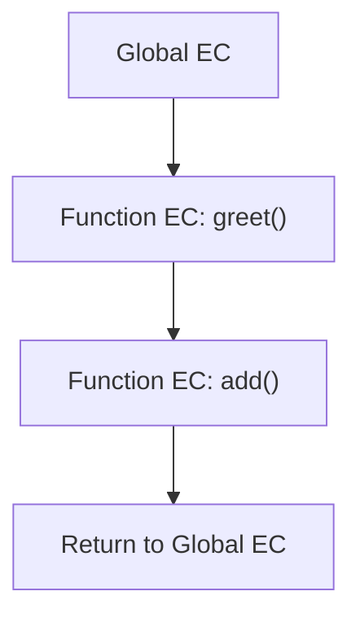
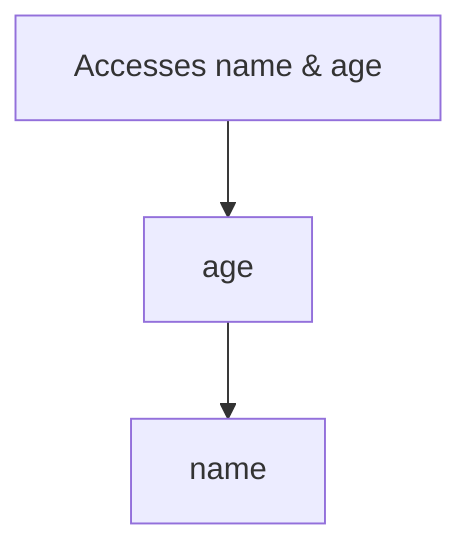

# 📘 Mastering JavaScript Execution Context (Beginner to Expert)

---

> 🧠 “Execution Context” is the heart of how JavaScript code runs. To become a JavaScript pro, understanding it is *non-negotiable*.

---

## 🧭 Table of Contents

* [📌 What is an Execution Context?](#-what-is-an-execution-context)
* [⚙️ Types of Execution Contexts](#️-types-of-execution-contexts)
* [🧪 Phases of Execution Context](#-phases-of-execution-context)
* [🧱 Internal Components](#-internal-components)
* [📚 Real-Life Analogies (Indian Examples)](#-real-life-analogies-indian-examples)
* [📶 Call Stack & Execution Context](#-call-stack--execution-context)
* [🔁 Recursion, Hoisting & Scope Chain](#-recursion-hoisting--scope-chain)
* [📊 Summary Table](#-summary-table)
* [🛠️ Mini Project Example](#️-mini-project-example)
* [❓ Quiz Section](#-quiz-section)
* [🔄 Recap](#-recap)

---

## 📌 What is an Execution Context?

An **Execution Context (EC)** is the **environment in which JavaScript code is evaluated and executed**.

Every time your code runs, JavaScript sets up an execution context to keep track of variables, functions, `this`, and more.

### 🧑‍💻 Simple Explanation

> Think of EC as a **room** where your JavaScript code runs. The room has all the supplies (variables, functions, `this`) you need.

---

## ⚙️ Types of Execution Contexts

JavaScript has **three main types**:

| Type             | When It's Created                        | Scope Level     |
| ---------------- | ---------------------------------------- | --------------- |
| 🟢 Global EC     | Created when JavaScript starts executing | Outermost       |
| 🟡 Functional EC | Created every time a function is called  | Nested          |
| 🔴 Eval EC       | Created when `eval()` is used            | Not recommended |

### 🌍 Global Execution Context (GEC)

```js
var name = "Kishore";
function greet() {
  console.log("Hello " + name);
}
greet();
```

* Created first.
* Contains global objects (`window` in browsers).
* `this` points to global object.

---

### 🔄 Functional Execution Context

```js
function add(a, b) {
  var result = a + b;
  return result;
}
add(5, 10);
```

* Each function call gets **its own EC**.
* Nested inside the global EC.

---

### 🚫 Eval Execution Context

```js
eval("var x = 2;");
```

* Avoid using `eval()`.
* Dynamically creates EC.
* Makes code harder to debug.

---

## 🧪 Phases of Execution Context

Every EC has **two phases**:

### 🔧 1. Creation Phase

* Sets up memory space for variables & functions.
* Hoisting happens here.

### ▶️ 2. Execution Phase

* Executes the code line-by-line.
* Assigns values, runs logic, etc.

---

## 🧱 Internal Components

Each EC is composed of:

| Component               | Purpose                                        |
| ----------------------- | ---------------------------------------------- |
| 📦 Variable Environment | Memory for variables and function declarations |
| 🔗 Lexical Environment  | Scope and access to outer ECs                  |
| 👤 `this` Binding       | Contextual reference to the current object     |

---

### 📦 Variable Environment

* Stores:

  * Variable declarations (`var`)
  * Function declarations
* Created **before** code runs.

### 🔗 Lexical Environment

> 📖 Think of it like a dictionary that maps variable names to memory locations.

* Helps **resolve identifiers**.
* Forms the **Scope Chain**.

### 👤 `this` Binding

* Depends on **how** a function is called:

  * Global: `this` → `window` (browser)
  * Inside object: `this` → object

```js
function show() {
  console.log(this);
}
show(); // window in browser
```

---

## 📚 Real-Life Analogies (Indian Examples)

### 🏫 School Analogy

* **Principal Office** → Global EC
* **Classroom** → Function EC
* **Blackboard** → Variable Environment
* **Lesson Plan** → Lexical Environment

### 🍲 Kitchen Analogy

* **Entire kitchen** → Global EC
* **Different stoves** → Function ECs
* **Ingredients** → Variables
* **Chef’s memory** → Lexical Environment

---

## 📶 Call Stack & Execution Context

JavaScript is **single-threaded** — one thing at a time.

### 📞 Call Stack

> Stack that keeps track of all ECs.



### 👣 Execution Flow

```js
function one() {
  console.log("One");
  two();
}

function two() {
  console.log("Two");
}

one();
```

### 🧱 ASCII Call Stack

```
| two() EC          |
| one() EC          |
| Global EC         |
```

When `two()` finishes:

```
| one() EC          |
| Global EC         |
```

---

## 🔁 Recursion, Hoisting & Scope Chain

### 🔁 Recursion Example

```js
function countdown(n) {
  if (n === 0) return;
  console.log(n);
  countdown(n - 1); // New EC pushed every time!
}
countdown(3);
```

---

### 🏋️ Hoisting

Variables and functions are hoisted (moved) to the top in the **Creation Phase**.

```js
console.log(x); // undefined
var x = 10;

sayHi(); // "Hi!"
function sayHi() {
  console.log("Hi!");
}
```

---

### 🌿 Scope Chain

```js
var name = "Ram";

function outer() {
  var age = 25;

  function inner() {
    console.log(name, age);
  }

  inner();
}
outer();
```

* `inner()` can access variables in `outer()` and global scope.
* **Lexical Environment** enables this.



---

## 📊 Summary Table

| Feature          | Global EC     | Function EC      | Eval EC            |
| ---------------- | ------------- | ---------------- | ------------------ |
| Created          | On page load  | On function call | On eval call       |
| `this`           | Global object | Depends on call  | Depends on context |
| Hoisting         | Yes           | Yes              | Yes                |
| Scope Chain      | Yes           | Yes              | Yes                |
| Call Stack Level | Base level    | Nested levels    | Nested (avoid)     |

---

## 🛠️ Mini Project Example

> 📁 A mini shopping cart that demonstrates EC and Call Stack behavior

```js
let cart = [];

function addToCart(item) {
  cart.push(item);
  showCart();
}

function showCart() {
  console.log("Cart:", cart);
}

addToCart("🍎 Apple");
addToCart("🍌 Banana");
```

* `addToCart()` → creates Function EC
* `showCart()` → new EC pushed
* After completion → stack pops ECs

---

## ❓ Quiz Section

<details>
<summary>Q1. What gets hoisted in the creation phase?</summary>

✅ Function declarations and `var` variables (as `undefined`)

</details>

<details>
<summary>Q2. What is the base of the call stack?</summary>

✅ The Global Execution Context

</details>

<details>
<summary>Q3. Is `let` hoisted?</summary>

✅ Yes, but not initialized (Temporal Dead Zone)

</details>

<details>
<summary>Q4. What does Lexical Environment mean?</summary>

✅ The structure that defines how variable names are resolved in nested scopes.

</details>

---

## 🔄 Recap

✅ **Execution Context** is the environment where code runs
✅ Types: Global, Functional, Eval
✅ Each EC has **Creation & Execution Phase**
✅ Internals: Variable Environment, Lexical Environment, `this`
✅ JavaScript uses a **Call Stack**
✅ Scope Chain, Hoisting, and Recursion all depend on EC behavior

---

### 🚀 Learn this well, and you'll understand:

* Scopes
* Closures
* Hoisting
* Asynchronous execution (when combined with Event Loop)
