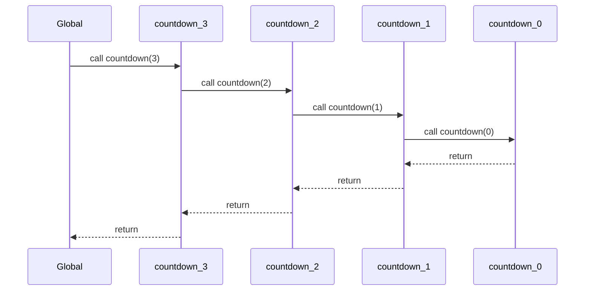

# 📘 JavaScript Execution Context — Full Breakdown (with Diagrams & Call Stack)

---

### ✅ **Section 1: What is an Execution Context?**

> 🧠 “An Execution Context is the environment in which JavaScript code is evaluated and executed.”

When JavaScript runs any code, it does so inside an **Execution Context (EC)**. Think of it as a **workspace or a room** where the code is unpacked, stored, and run.

#### 🍛 Real-Life Analogy (Indian Style):
> **Kitchen Analogy**:  
> - 👨‍🍳 The Head Cook (Global EC) manages the whole kitchen.  
> - 🍽️ Each Assistant Cook (Function EC) takes care of their own dish.  
> - When an assistant needs help, they call another helper (nested function), and he steps in.  
> - When the job is done, helpers return control back to the head.

---

### ✅ **Section 2: Why is it Important?**

JavaScript is **single-threaded**, meaning it can execute **one task at a time**. EC plays a key role in organizing this task queue.

#### 🎯 Why EC matters:
- Helps manage variable access and function execution.
- Controls the **scope chain** and how variables are resolved.
- Enables **call stack** behavior and **recursion**.

```js
function greet() {
  let name = "Ram";
  console.log("Hello " + name); // EC of greet() manages 'name'
}

greet();
````

---

### ✅ \*\*Section 3: When is EC Created?

There are **3 types** of Execution Contexts in JavaScript:

<details>
<summary>🌍 Global Execution Context</summary>

* Created when JS starts execution.
* Only one per program.
* Attaches to `window` in browsers.

</details>

<details>
<summary>🧩 Function Execution Context</summary>

* Created whenever a function is called.
* Each call gets a **new EC**.

</details>

<details>
<summary>📜 Eval Execution Context</summary>

* Created inside `eval()` function (rarely used).
* Executes code passed as a string.

</details>

#### 🧬 EC Creation Flow

```
graph TD
  A[Start JS Program] --> B[Global EC Created]
  B --> C[Function EC (if any called)]
  C --> D[More Nested ECs...]
```

---

### ✅ **Section 4: Phases of EC**

Each Execution Context goes through **2 phases**:

| Phase           | What Happens                                    |
| --------------- | ----------------------------------------------- |
| Creation Phase  | Memory is allocated for variables and functions |
| Execution Phase | Code runs line by line, values are assigned     |

#### 🔍 Hoisting Behavior

| Keyword | Hoisted? | Initialized to?   | TDZ Exists? |
| ------- | -------- | ----------------- | ----------- |
| `var`   | ✅ Yes    | `undefined`       | ❌ No        |
| `let`   | ✅ Yes    | ❌ Not initialized | ✅ Yes       |
| `const` | ✅ Yes    | ❌ Not initialized | ✅ Yes       |

---

### ✅ **Section 5: Internal Structure**

Each EC has three key parts:

```
┌────────────────────────────┐
│  Execution Context (EC)    │
│ ┌────────────────────────┐ │
│ │ Variable Environment   │ │
│ └────────────────────────┘ │
│ ┌────────────────────────┐ │
│ │ Lexical Environment    │ │
│ └────────────────────────┘ │
│ ┌────────────────────────┐ │
│ │ this Binding           │ │
│ └────────────────────────┘ │
└────────────────────────────┘
```

#### 💡 Definitions:

* **Variable Environment**: Stores `var`, `function` declarations.
* **Lexical Environment**: Tracks block-scoped variables (`let`, `const`) and function closures.
* **`this` Binding**: Contextual reference to the object (e.g., global object or function caller).

---

### ✅ **Section 6: Call Stack Explained**

The **Call Stack** is a stack data structure where each EC is pushed/popped during execution.

```js
function countdown(n) {
  if (n === 0) return;
  console.log(n);
  countdown(n - 1);
}
countdown(3);
```

#### 📦 Call Stack Flow (ASCII)

```
| countdown(3)  |
| countdown(2)  |
| countdown(1)  |
| countdown(0)  |
| Global EC     |
|_______________|
```

#### 🧬 Mermaid Diagram:



---

### ✅ **Section 7: Hoisting + Scope Chain in EC**

```js
function test() {
  console.log(a); // undefined (var hoisted)
  console.log(b); // ReferenceError (let not hoisted)
  var a = 10;
  let b = 20;
}
```

#### 🔗 Scope Chain

```js
const x = 10;

function outer() {
  const y = 20;
  function inner() {
    const z = 30;
    console.log(x, y, z); // 10 20 30 — looks outward
  }
  inner();
}
outer();
```

---

### ✅ **Section 8: Recursion and Stack Overflow**

```js
function recurse() {
  recurse(); // No base case 😵
}

recurse(); // 💥 RangeError: Maximum call stack size exceeded
```

#### 🧠 Cause:

* Each call creates a new EC.
* No return = stack never clears.

```
graph TD
  R1[recurse()] --> R2[recurse()] --> R3[recurse()] --> ... --> 💥[Stack Overflow]
```

---

### ✅ **Section 9: Real-Life Analogy (Indian Style)**

#### 🏫 **School Analogy**:

* Teacher = Global EC
* Student = Function EC
* When students need help, they ask their friends (nested functions). The teacher oversees everything.

#### 🍲 **Kitchen Analogy**:

* Head Cook = Global EC
* Line Cook = Function EC
* Each Line Cook handles a specific recipe. They finish and return control to Head Cook.

---

### ✅ **Section 10: Quiz Section (Self-Check)**

#### ✅ MCQs

* [ ] What creates a new EC?

  * A. Variable declaration
  * B. Function call ✅
  * C. console.log
  * D. let keyword

* [ ] What phase does hoisting happen in?

  * A. Execution
  * B. Parsing
  * C. Creation ✅
  * D. Evaluation

* [ ] Which is not a type of EC?

  * A. Global
  * B. Function
  * C. Block ✅
  * D. Eval

* [ ] What does the call stack do?

  * A. Stores objects
  * B. Tracks execution order ✅
  * C. Saves cookies
  * D. Optimizes loops

* [ ] `this` in the global context refers to?

  * A. null
  * B. window ✅
  * C. function
  * D. object

#### 🔍 Predict the Output:

```js
function foo() {
  console.log(a);
  var a = 5;
}
foo();
```

* [ ] A. 5
* [ ] B. undefined ✅
* [ ] C. ReferenceError
* [ ] D. null

---

### ✅ **Section 11: Real Mini Project Walkthrough**

🧮 **Mini Project: Stopwatch**

```js
let startTime;

function start() {
  startTime = Date.now(); // ⏱ Function EC
}

function stop() {
  const endTime = Date.now(); // ⏱ Function EC
  const diff = endTime - startTime;
  console.log("Elapsed: " + diff + "ms");
}

start(); // EC: start()
setTimeout(stop, 2000); // EC: stop()
```

> Each function call (start, stop) creates its own EC, and accesses `startTime` via **scope chain**.

---

### ✅ **Section 12: Summary Table**

| Term              | Meaning                                  |
| ----------------- | ---------------------------------------- |
| Execution Context | Room where JS runs code                  |
| Call Stack        | Stack of ECs                             |
| Creation Phase    | Memory allocated                         |
| Lexical Scope     | Static reference to outer code           |
| Hoisting          | Pre-loading of vars/functions (var only) |

---

### ✅ **Section 13: Final Recap & Next Steps**

Every line of JavaScript code runs inside an **Execution Context**.
These contexts are pushed to the **Call Stack**, have their own phases, and govern things like `this`, scope, and hoisting.

👉 Now try debugging your code using the **Chrome DevTools → Sources → Call Stack Tab** to watch ECs in action!

---

```
```
