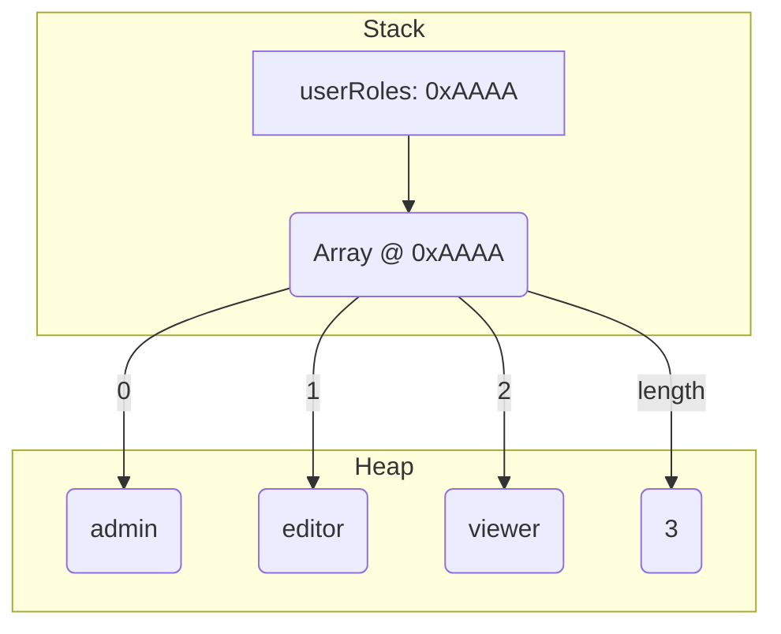

# 🚀 JavaScript Phase 1: Mastery Journey

## 🧠 Topics Covered
- Variables, Scopes, and Hoisting
- Data Types and Conversion
- Control Structures
- Loops and Iteration Techniques
- Functions and Arrow Syntax
- Objects, Arrays, and JSON
- Real-World Challenges + Debugging Patterns

## 🔬 Deep Dive Practice

---

## 1. `var`, `let`, `const` — Declarations, Hoisting, and Scope

Understanding how JavaScript declares and manages variables is foundational. The introduction of `let` and `const` in ES6 significantly changed variable behavior, making code more predictable and less error-prone.

### ✅ What: Variable Declarations
`var`, `let`, and `const` are keywords used to declare variables in JavaScript. They differ in terms of their **scope**, **hoisting behavior**, and **reassignability**.

### ✅ Why: Predictable Code & Error Prevention
Choosing the right declaration keyword is crucial for:
* **Preventing accidental re-declarations or reassignments:** Enhances code stability.
* **Controlling variable visibility:** Reduces cognitive load and prevents unintended side effects.
* **Improving maintainability:** Clearer intent leads to easier debugging and refactoring.
* **Enabling modern best practices:** `let` and `const` are generally preferred over `var`.

### ✅ How: Detailed Breakdown

#### `var` (Legacy Declaration)

* **Scope:** `function-scoped`. This means a `var` declared inside a function is only accessible within that function. If declared outside any function, it's `global-scoped`. `var` does *not* respect block scope (e.g., `if` blocks, `for` loops).
* **Hoisting:** `var` declarations are **hoisted** to the top of their immediate function or global scope during the compilation phase. Their *initialization* (assignment) is *not* hoisted. This means you can access a `var` before its declaration, but its value will be `undefined`.
* **Re-declaration & Reassignment:** Can be re-declared and reassigned within the same scope.

**🧠 Memory Visualization for `var`**

```mermaid
graph TD
    subgraph Global Execution Context
        GCS(Global Code Space)
        GV(Global Variable Environment)
        CallStack[Call Stack]
        ---
        subgraph Hoisting Phase
            VarDeclHoisted(myLegacyVar: undefined)
        end
        subgraph Execution Phase
            Code1("myLegacyVar = 'Initial Value';")
            Code2("console.log(myLegacyVar);")
            Code3("var myLegacyVar = 'New Value';")
            Code4("console.log(myLegacyVar);")
        end
    end
    GV -- binds to --> GlobalMemory[Global Memory (Heap/Stack)]
    GlobalMemory -- stores --> M1(myLegacyVar: undefined --> "Initial Value" --> "New Value")

    style VarDeclHoisted fill:#ffc,stroke:#333,stroke-width:1px
    style Code1 fill:#d4edda,stroke:#28a745,stroke-width:1px
    style M1 fill:#f0f8ff,stroke:#6a5acd,stroke-width:1px
```

**Code Example: `var`**

```javascript
// backend/controllers/userController.js (simulated backend context)

console.log('User status (before declaration):', userStatus); // What happens here?

if (true) {
  var userStatus = 'active'; // This is function-scoped (or global-scoped here)
  var userRole = 'admin'; // Re-declared, no error
  console.log('Inside block - User status:', userStatus);
}

var userRole = 'guest'; // Re-declared, no error. Overwrites previous 'admin'.
console.log('Outside block - User status:', userStatus);
console.log('User role (outside block):', userRole);

function processUser() {
  var userStatus = 'processing'; // Different variable, function-scoped
  console.log('Inside function - User status:', userStatus);
}

processUser();
console.log('After function - User status:', userStatus); // Original userStatus
```

**Output:**

```
User status (before declaration): undefined
Inside block - User status: active
Outside block - User status: active
User role (outside block): guest
Inside function - User status: processing
After function - User status: active
```

**Explanation:**

1.  `console.log('User status (before declaration):', userStatus);`
    * **Hoisting in action:** Even though `userStatus` is declared later, `var userStatus;` is "moved" to the top of the global scope. So, `userStatus` exists but is `undefined`.
2.  `var userStatus = 'active';`
    * `userStatus` (which was `undefined`) is now assigned `'active'`.
    * Since `var` is not block-scoped, this declaration inside the `if` block applies to the global scope.
3.  `var userRole = 'admin';`
    * `userRole` is declared and assigned.
4.  `var userRole = 'guest';`
    * This is a *re-declaration* of `userRole` in the same scope, which is allowed with `var`. It simply reassigns the value from `'admin'` to `'guest'`.
5.  `function processUser() { var userStatus = 'processing'; ... }`
    * This `userStatus` is *different* from the global one. It's **function-scoped** to `processUser`.
6.  `console.log('After function - User status:', userStatus);`
    * Prints the original global `userStatus` (`'active'`), as the function's `userStatus` is out of scope.

**Advanced Edge Case:** Accidental global variable. If you forget `var`, `let`, or `const` in non-strict mode, it will become a global variable, polluting the global namespace. `use strict;` helps prevent this.

```javascript
function createReport() {
    reportId = 'RPT-123'; // No 'var/let/const' - becomes global in non-strict mode
    console.log("Report generated:", reportId);
}
// createReport();
// console.log("Global reportId:", reportId); // Accessible here (in non-strict mode)
```

#### `let` (Modern Declaration)

* **Scope:** `block-scoped`. This means a `let` declared inside any block (e.g., `if`, `for`, `{}`) is only accessible within that block.
* **Hoisting & TDZ:** `let` declarations are also **hoisted**, but they are placed in a **Temporal Dead Zone (TDZ)**. This means the variable exists, but you cannot access it (read or write) before its declaration in code. Attempting to do so results in a `ReferenceError`.
* **Re-declaration & Reassignment:** Cannot be re-declared in the same scope. Can be reassigned.

**🧠 Memory Visualization & TDZ for `let`**

```mermaid
graph TD
    subgraph Execution Context (e.g., Global or Function)
        A[Creation Phase: myItem is "created" but uninitialized]
        B[Temporal Dead Zone (TDZ) for myItem]
        C[Code: console.log(myItem); -- Attempt to access in TDZ]
        D[Code: let myItem = 'Widget'; -- Declaration and Initialization]
        E[Code: console.log(myItem); -- myItem is now accessible]
        F[Code: let myItem = 'Another Widget'; -- Attempt to re-declare]
        G[Code: myItem = 'Updated Widget'; -- Reassignment]
    end

    A --> B
    B -- access attempt --> C
    C -- ReferenceError --> H(Execution Halted)
    B -- declaration and initialization --> D
    D --> E(myItem: 'Widget')
    E --> G(myItem: 'Updated Widget')
    D -- re-declaration attempt --> F
    F -- SyntaxError --> H

    style A fill:#ffc,stroke:#333,stroke-width:1px
    style B fill:#f8d5d5,stroke:#dc3545,stroke-width:2px,color:#dc3545
    style H fill:#f8d5d5,stroke:#dc3545,stroke-width:2px,color:#dc3545
```

**Code Example: `let`**

```javascript
// frontend/components/ProductDisplay.js (simulated frontend context)

// console.log('Product ID (before declaration):', productId); // Uncommenting this line causes ReferenceError

let productId = 'PROD-001';
console.log('Product ID (initial):', productId); // Output: PROD-001

if (true) {
  let productId = 'PROD-002'; // This is a NEW, block-scoped variable
  console.log('Inside block - Product ID:', productId); // Output: PROD-002

  productId = 'PROD-003'; // Reassignment of the block-scoped productId
  console.log('Inside block (reassigned) - Product ID:', productId); // Output: PROD-003

  // let productId = 'PROD-004'; // Uncommenting this causes SyntaxError: 'productId' has already been declared
}

console.log('Outside block - Product ID:', productId); // Output: PROD-001 (original outer scope)

productId = 'PROD-005'; // Reassignment of the outer-scoped productId
console.log('Outside block (reassigned) - Product ID:', productId); // Output: PROD-005
```

**Output:**

```
Product ID (initial): PROD-001
Inside block - Product ID: PROD-002
Inside block (reassigned) - Product ID: PROD-003
Outside block - Product ID: PROD-001
Outside block (reassigned) - Product ID: PROD-005
```

**Explanation:**

1.  `let productId = 'PROD-001';`
    * `productId` is declared and initialized in the global scope.
2.  `if (true) { let productId = 'PROD-002'; ... }`
    * Inside the `if` block, a *new*, separate `productId` variable is declared. This variable only exists within this block.
    * The outer `productId` is not affected.
3.  `productId = 'PROD-003';`
    * This reassigns the value of the *block-scoped* `productId`.
4.  `// let productId = 'PROD-004';`
    * If uncommented, this would cause a `SyntaxError` because `productId` has already been declared with `let` in *this specific block scope*.
5.  `console.log('Outside block - Product ID:', productId);`
    * This prints the value of the `productId` from the *outer scope* (`'PROD-001'`), demonstrating block scoping.

#### `const` (Constant Declaration)

* **Scope:** `block-scoped`, just like `let`.
* **Hoisting & TDZ:** Also hoisted into the Temporal Dead Zone (TDZ). Must be accessed after its declaration.
* **Re-declaration & Reassignment:** Cannot be re-declared *or* reassigned after its initial assignment. It creates a read-only binding.

**🧠 Memory Visualization & TDZ for `const`**

```mermaid
graph TD
    subgraph Execution Context
        A[Creation Phase: API_KEY is "created" but uninitialized]
        B[Temporal Dead Zone (TDZ) for API_KEY]
        C[Code: console.log(API_KEY); -- Attempt to access in TDZ]
        D[Code: const API_KEY = 'YOUR_SECRET'; -- Declaration and Initialization]
        E[Code: console.log(API_KEY); -- API_KEY is now accessible]
        F[Code: API_KEY = 'NEW_SECRET'; -- Attempt to reassign]
        G[Code: const API_KEY = 'OTHER_SECRET'; -- Attempt to re-declare]
    end

    A --> B
    B -- access attempt --> C
    C -- ReferenceError --> H(Execution Halted)
    B -- declaration and initialization --> D
    D --> E(API_KEY: 'YOUR_SECRET')
    D -- reassign attempt --> F
    F -- TypeError --> H
    D -- re-declaration attempt --> G
    G -- SyntaxError --> H

    style A fill:#ffc,stroke:#333,stroke-width:1px
    style B fill:#f8d5d5,stroke:#dc3545,stroke-width:2px,color:#dc3545
    style H fill:#f8d5d5,stroke:#dc3545,stroke-width:2px,color:#dc3545
```

**Code Example: `const`**

```javascript
// backend/config/db.js (simulated backend config)

// console.log('Database URL (before declaration):', DB_URL); // Uncommenting this causes ReferenceError

const DB_URL = 'mongodb://localhost:27017/my_app_db';
console.log('Database URL:', DB_URL); // Output: mongodb://localhost:27017/my_app_db

// DB_URL = 'mongodb://production:27017/my_app_db_prod'; // Uncommenting this causes TypeError: Assignment to constant variable.
// console.log('Database URL (reassigned):', DB_URL);

if (true) {
  // const DB_URL = 'another_url'; // Uncommenting this causes SyntaxError: 'DB_URL' has already been declared
                                  // (if DB_URL was declared in the same scope)
                                  // If DB_URL was in a *different* block, this would be a new variable.
  const API_TIMEOUT_MS = 5000;
  console.log('Inside block - API Timeout:', API_TIMEOUT_MS);
}

// console.log('Outside block - API Timeout:', API_TIMEOUT_MS); // Uncommenting this causes ReferenceError: API_TIMEOUT_MS is not defined
```

**Output:**

```
Database URL: mongodb://localhost:27017/my_app_db
Inside block - API Timeout: 5000
```

**Explanation:**

1.  `const DB_URL = '...';`
    * `DB_URL` is declared and initialized. It cannot be reassigned.
2.  `// DB_URL = '...';`
    * Attempting to reassign `DB_URL` causes a `TypeError` because `const` creates a read-only binding.
3.  `if (true) { const API_TIMEOUT_MS = 5000; ... }`
    * `API_TIMEOUT_MS` is block-scoped. It only exists within the `if` block.
4.  `// console.log('Outside block - API Timeout:', API_TIMEOUT_MS);`
    * If uncommented, this would cause a `ReferenceError` because `API_TIMEOUT_MS` is out of scope.
5.  **Important Note for Objects/Arrays with `const`:**
    `const` prevents reassignment of the *variable binding itself*, not the *contents* of the object/array it points to.

    ```javascript
    const userProfile = { name: 'Alice', age: 30 };
    userProfile.age = 31; // This is allowed! The object's property is changed.
    console.log(userProfile); // { name: 'Alice', age: 31 }

    // userProfile = { name: 'Bob' }; // This would cause a TypeError! The binding cannot be reassigned.
    ```

**When to use which (ES6+ Best Practices):**

* **`const` (Default):** Always prefer `const` unless you know the variable's value will change. This signals intent, improves readability, and prevents accidental reassignments. It's especially useful for configurations, imported modules, and elements/references that shouldn't change.
* **`let` (When Reassignment is Needed):** Use `let` when you expect a variable's value to be reassigned later in its scope. Common scenarios include loop counters, variables that hold accumulating results, or values that change based on user interaction or API responses.
* **`var` (Avoid):** Avoid using `var` in modern JavaScript code. Its function-scoping and hoisting behavior often lead to unexpected bugs (especially in loops and with global variables) and make code harder to reason about. Stick to `let` and `const`.

---

## 2. Primitive vs Reference Data Types

Understanding how data is stored in memory is fundamental to debugging subtle bugs related to variable assignments and function arguments.

### ✅ What: Data Storage Mechanisms

JavaScript's data types are categorized by how their values are stored and accessed in memory:

* **Primitive Data Types:** Store their actual value directly in the memory location where the variable resides.
    * `string`, `number`, `boolean`, `null`, `undefined`, `symbol` (ES6), `bigint` (ES11)
* **Reference Data Types (Objects):** Store a *reference* (memory address) to a location in memory (the heap) where the actual object data is stored.
    * `Object`, `Array`, `Function`, `Date`, `RegExp`, etc. (anything that is not a primitive)

### ✅ Why: Predictable Data Manipulation

This distinction is crucial for:
* **Understanding assignment behavior:** When you assign one variable to another.
* **Function argument passing:** How data behaves when passed to functions.
* **Mutating data:** Knowing when a change to one variable will affect another.
* **Debugging unexpected side effects:** Preventing bugs where changing one part of your application unknowingly alters data elsewhere.

### ✅ How: Stack vs Heap Visualizations

**🧠 Stack vs Heap Memory Model**

```mermaid
graph TD
    subgraph Call Stack (LIFO)
        S1[Global Execution Context]
        S2[Function Call A]
        S3[Function Call B]
    end

    subgraph Memory (RAM)
        direction LR
        subgraph Stack Memory (Fixed Size, Fast Access)
            Stk1[Variable: 'userCount']
            Stk2[Value: 150]

            Stk3[Variable: 'isValidSession']
            Stk4[Value: true]

            Stk5[Variable: 'username']
            Stk6[Value: "devUser"]

            Stk7[Variable: 'apiResponseRef']
            Stk8[Value: (Memory Address: 0xABCD)] -- points to --> Heap1
        end

        subgraph Heap Memory (Dynamic, Slower Access)
            Heap1[Object: { status: 'success', data: [...] }]
            Heap2[Array: ['item1', 'item2', 'item3']]
            Heap3[Function: processData()]
        end
    end

    S1 --- "holds reference to" --- Stk1
    S2 --- "holds reference to" --- Stk3
    S3 --- "holds reference to" --- Stk7

    style Stk1 fill:#d4edda,stroke:#28a745,stroke-width:1px
    style Stk2 fill:#f8f9fa,stroke:#ccc,stroke-width:1px
    style Stk3 fill:#d4edda,stroke:#28a745,stroke-width:1px
    style Stk4 fill:#f8f9fa,stroke:#ccc,stroke-width:1px
    style Stk5 fill:#d4edda,stroke:#28a745,stroke-width:1px
    style Stk6 fill:#f8f9fa,stroke:#ccc,stroke-width:1px
    style Stk7 fill:#d4edda,stroke:#28a745,stroke-width:1px
    style Stk8 fill:#f8f9fa,stroke:#ccc,stroke-width:1px

    style Heap1 fill:#fff3cd,stroke:#ffc107,stroke-width:1px
    style Heap2 fill:#fff3cd,stroke:#ffc107,stroke-width:1px
    style Heap3 fill:#fff3cd,stroke:#ffc107,stroke-width:1px
```

* **Stack:** Used for static memory allocation. Stores primitive values directly and references (memory addresses) to objects on the heap. Function calls and their local primitive variables are pushed onto the stack. Fast access.
* **Heap:** Used for dynamic memory allocation. Stores objects and arrays (reference types) whose size might not be known at compile time or can change during execution. Slower access than stack.

**Code Example: Primitive vs Reference**

```javascript
// frontend/utils/dataHandler.js (simulated data handling)

// --- Primitives ---
let apiCallCount = 0; // Stored directly on stack
let userId = 'user_abc_123'; // Stored directly on stack

let tempCount = apiCallCount; // Copies the VALUE from apiCallCount
tempCount = 5;
console.log('Original API Call Count:', apiCallCount); // Output?

// --- References (Objects/Arrays) ---
const userPreferences = { // userPreferences variable (on stack) holds reference to object (on heap)
  theme: 'dark',
  notifications: true
};

const settingsCopy = userPreferences; // Copies the REFERENCE, not the object itself
settingsCopy.theme = 'light'; // Mutates the OBJECT on the heap, via settingsCopy's reference

console.log('User Preferences after copy mutation:', userPreferences.theme); // Output?

const adminRoles = ['super_admin', 'dev_ops']; // adminRoles variable (on stack) holds reference to array (on heap)
const newRoles = adminRoles; // Copies the REFERENCE
newRoles.push('support_staff'); // Mutates the ARRAY on the heap

console.log('Admin Roles after push:', adminRoles); // Output?

// --- Deep Copy vs Shallow Copy (Crucial for references) ---
const configDefaults = {
  timeout: 3000,
  endpoints: {
    users: '/api/users',
    products: '/api/products'
  }
};

// Shallow copy (only top-level properties are copied by value/reference)
const userConfig = { ...configDefaults }; // Spreads top-level properties
userConfig.timeout = 5000; // Primitive, direct value change on userConfig's stack location
userConfig.endpoints.products = '/api/v2/products'; // Modifies the NESTED OBJECT on the heap (same reference)

console.log('Config Defaults Timeout:', configDefaults.timeout); // Output?
console.log('Config Defaults Products Endpoint:', configDefaults.endpoints.products); // Output?

// Deep copy (for completely independent copies, especially for nested objects/arrays)
// Common for state management (Redux, Vuex) where immutability is key.
const backupConfig = JSON.parse(JSON.stringify(configDefaults)); // Simple deep copy, but has limitations (e.g., functions, Date objects)
backupConfig.endpoints.users = '/api/v3/users'; // Modifies a NEW object on heap

console.log('Config Defaults Users Endpoint (after deep copy):', configDefaults.endpoints.users); // Output?
```

**Output:**

```
Original API Call Count: 0
User Preferences after copy mutation: light
Admin Roles after push: [ 'super_admin', 'dev_ops', 'support_staff' ]
Config Defaults Timeout: 3000
Config Defaults Products Endpoint: /api/v2/products
Config Defaults Users Endpoint (after deep copy): /api/users
```

**Explanation:**

1.  **Primitives:** `apiCallCount` and `userId` are primitives. When `tempCount = apiCallCount;` happens, the *value* `0` is copied to `tempCount`. Subsequent changes to `tempCount` do not affect `apiCallCount`. This is **pass-by-value**.
2.  **References (Shallow Copy):**
    * `userPreferences` holds a reference (memory address) to the object `{ theme: 'dark', notifications: true }` on the heap.
    * `settingsCopy = userPreferences;` copies the *reference* itself. Now both `userPreferences` and `settingsCopy` point to the *same object* on the heap.
    * `settingsCopy.theme = 'light';` modifies the object at that shared memory address. Therefore, `userPreferences.theme` also reflects this change. This is often referred to as **pass-by-reference** or **pass-by-sharing** (where the value passed is the reference).
    * The same logic applies to `adminRoles` and `newRoles`. `newRoles.push()` modifies the array on the heap, which `adminRoles` also points to.
3.  **Shallow vs Deep Copy:**
    * `userConfig = { ...configDefaults };` performs a **shallow copy**.
        * `userConfig.timeout = 5000;` works as expected because `timeout` is a primitive. `userConfig` gets its own `timeout` property on the stack.
        * `userConfig.endpoints.products = '/api/v2/products';` affects `configDefaults.endpoints.products` because the `endpoints` property (which is an object) was copied *by reference*. So, `userConfig.endpoints` and `configDefaults.endpoints` still point to the *same nested object* on the heap.
    * `backupConfig = JSON.parse(JSON.stringify(configDefaults));` performs a simple **deep copy**. `JSON.stringify` converts the object to a string, and `JSON.parse` converts it back to a new object. This creates a completely new, independent object on the heap, including all nested objects/arrays. Changes to `backupConfig` will *not* affect `configDefaults`.

**Developer Usage:**

* **State Management:** In frameworks like React or Redux, state immutability is a core principle. You *never* directly mutate state objects or arrays. Instead, you create new copies (using spread syntax for shallow copies, or libraries like Lodash's `cloneDeep` for deep copies) to trigger re-renders and maintain predictable data flow.
* **Configuration Objects:** When passing configuration objects around, be mindful if a function might mutate it. If the function needs its own independent copy, perform a deep copy.
* **Function Arguments:** When passing objects or arrays to functions, remember that changes made to the object/array *inside* the function will be reflected *outside* the function (because the function receives a copy of the *reference*).

```javascript
// frontend/services/apiService.js

// Function that might modify an object passed to it
function addTimestampToRequest(requestBody) {
  // requestBody is a reference to the original object
  requestBody.timestamp = new Date().toISOString();
  // No return needed, as the original object is modified
}

const payload = { userId: '123', data: { orderId: 'ABC' } };
addTimestampToRequest(payload);
console.log(payload); // { userId: '123', data: { orderId: 'ABC' }, timestamp: '...' } - payload was modified!

// If you wanted to avoid mutation:
function addTimestampToRequestImmutable(requestBody) {
  return { ...requestBody, timestamp: new Date().toISOString() };
}
const payload2 = { userId: '456', data: { itemId: 'DEF' } };
const newPayload = addTimestampToRequestImmutable(payload2);
console.log(payload2);    // { userId: '456', data: { itemId: 'DEF' } } - Original payload2 is unchanged
console.log(newPayload);  // { userId: '456', data: { itemId: 'DEF' }, timestamp: '...' } - A new object
```

---

## 3. Type Coercion & Conversion

JavaScript is a dynamically typed language, which means variables can hold values of different types, and the language often performs automatic type conversion (coercion). This can be a source of flexibility but also of subtle bugs.

### ✅ What: Automatic vs Explicit Type Changes

* **Type Coercion (Implicit Conversion):** JavaScript automatically converts one data type to another when operations involve mismatched types (e.g., `==`, `+` with string and number). This happens behind the scenes without explicit instruction.
* **Type Conversion (Explicit Conversion):** You, the developer, explicitly use functions or methods to convert a value from one type to another (e.g., `Number()`, `String()`, `Boolean()`, `parseInt()`).

### ✅ Why: Understanding Language Behavior & Preventing Bugs

* **Predicting outcomes:** Knowing how coercion works helps you understand why `1 + "2"` results in `"12"` and not `3`.
* **Debugging unexpected values:** Many "NaN" or unexpected `true`/`false` evaluations stem from coercion.
* **Writing robust code:** Explicit conversion makes your intent clear and reduces reliance on implicit behaviors that might change or be misunderstood.
* **Handling API responses/user input:** Data from external sources often comes as strings (e.g., form fields, JSON values) and needs explicit conversion for calculations or logical checks.

### ✅ How: Detailed Breakdown

**Truthy and Falsy Values:**
In conditional contexts (e.g., `if` statements, ternary operators, logical operators `&&`, `||`), JavaScript coerces values to `boolean`.
* **Falsy values:** `false`, `0`, `-0`, `0n` (BigInt zero), `""` (empty string), `null`, `undefined`, `NaN`.
* **Truthy values:** Everything else. (e.g., `'0'`, `' '`, `[]`, `{}`, `function() {}`)

**Code Example: Coercion & Conversion**

```javascript
// frontend/forms/validation.js (simulated form validation logic)

// --- Implicit Coercion Traps ---
console.log('--- Implicit Coercion Traps ---');

// 1. String Concatenation vs Arithmetic
const formInputQty = "5"; // Received from a text input
const fixedCharge = 2;
console.log(`Calc 1: ${formInputQty + fixedCharge}`); // Output? (String + Number)

// 2. Loose Equality (==)
const userIdFromURL = "123";
const loggedInUserId = 123;
console.log(`Calc 2: ${userIdFromURL == loggedInUserId}`); // Output? (String == Number)

const adminFlag = "true"; // Received from a checkbox value
console.log(`Calc 3: ${adminFlag == true}`); // Output? (String == Boolean)

// 3. Logical Operators (&&, ||)
const userSessionId = ''; // Empty string means no session
const defaultMessage = 'Guest User';
const displayMessage = userSessionId || defaultMessage; // What is evaluated here?
console.log(`Calc 4: ${displayMessage}`); // Output?

const isOnline = true;
const hasPremium = false;
const canAccessFeature = isOnline && hasPremium; // What is evaluated here?
console.log(`Calc 5: ${canAccessFeature}`); // Output?

// --- Explicit Conversion Best Practices ---
console.log('\n--- Explicit Conversion Best Practices ---');

// 1. To Number
const qtyInput = "10";
const pricePerUnit = 15.50;
const totalCost = Number(qtyInput) * pricePerUnit; // Using Number()
console.log(`Calc 6 (Explicit Number): ${totalCost}`); // Output?

const orderIdStr = "ORD-007";
// const parsedOrderId = Number(orderIdStr); // This would result in NaN
const parsedOrderId = parseInt(orderIdStr.replace('ORD-', '')); // Robust parsing
console.log(`Calc 7 (Explicit ParseInt): ${parsedOrderId}`); // Output?

// 2. To String
const statusCode = 200;
const statusMessage = String(statusCode); // Using String()
console.log(`Calc 8 (Explicit String): ${typeof statusMessage}`); // Output?

// 3. To Boolean
const userAgreed = "on"; // From a checkbox
const isAgreed = Boolean(userAgreed); // Using Boolean()
console.log(`Calc 9 (Explicit Boolean): ${isAgreed}`); // Output?

const responseData = null;
const hasData = Boolean(responseData); // What happens to null?
console.log(`Calc 10 (Explicit Boolean null): ${hasData}`); // Output?

// --- Traps and Mitigations ---
console.log('\n--- Traps and Mitigations ---');

// The infamous `+` operator trap (string vs number)
const valueA = '10';
const valueB = '5';
console.log(`Trap 1: ${valueA + valueB}`); // String concatenation
console.log(`Mitigation 1: ${Number(valueA) + Number(valueB)}`); // Explicit conversion

// Loose equality (==) vs Strict equality (===)
const apiStatus = 200;
const userStatus = '200';
console.log(`Trap 2 (loose): ${apiStatus == userStatus}`); // Coercion happens
console.log(`Mitigation 2 (strict): ${apiStatus === userStatus}`); // No coercion

// NaN (Not-a-Number) behavior
const result = Number("hello") + 5;
console.log(`Trap 3 (NaN): ${result}`); // NaN
console.log(`Mitigation 3 (isNaN): ${isNaN(result)}`); // true
console.log(`Mitigation 3 (Number.isNaN): ${Number.isNaN(result)}`); // true (more robust than global isNaN)
```

**Output:**

```
--- Implicit Coercion Traps ---
Calc 1: 52
Calc 2: true
Calc 3: false
Calc 4: Guest User
Calc 5: false

--- Explicit Conversion Best Practices ---
Calc 6 (Explicit Number): 155
Calc 7 (Explicit ParseInt): 7
Calc 8 (Explicit String): string
Calc 9 (Explicit Boolean): true
Calc 10 (Explicit Boolean null): false

--- Traps and Mitigations ---
Trap 1: 105
Mitigation 1: 15
Trap 2 (loose): true
Mitigation 2 (strict): false
Trap 3 (NaN): NaN
Mitigation 3 (isNaN): true
Mitigation 3 (Number.isNaN): true
```

**Explanation:**

* **`formInputQty + fixedCharge` (`"5" + 2`):** When the `+` operator encounters a string, it prioritizes string concatenation. So, `2` is coerced to `"2"`, and the result is `"52"`.
* **`userIdFromURL == loggedInUserId` (`"123" == 123`):** The `==` (loose equality) operator performs type coercion. It tries to convert one operand to match the type of the other. Here, `"123"` is coerced to `123`, making the comparison `123 == 123`, which is `true`.
* **`adminFlag == true` (`"true" == true`):** The string `"true"` is coerced to a number (`NaN`), and `true` is coerced to `1` during the `==` comparison. `NaN == 1` is `false`. This is a common pitfall!
* **`userSessionId || defaultMessage` (`'' || 'Guest User'`):** The `||` (OR) operator returns the first *truthy* value. `''` (empty string) is falsy, so it moves to `defaultMessage` which is truthy.
* **`isOnline && hasPremium` (`true && false`):** The `&&` (AND) operator returns the first *falsy* value. `hasPremium` is `false`, so it returns `false`.
* **`Number(qtyInput)`:** Explicitly converts the string `"10"` to the number `10`, allowing correct arithmetic.
* **`parseInt()`:** Parses a string and returns an integer. Useful for extracting numerical parts from mixed strings.
* **`String(statusCode)`:** Explicitly converts the number `200` to the string `"200"`.
* **`Boolean(userAgreed)`:** Explicitly converts `"on"` to `true` (as it's a non-empty string, it's truthy).
* **`Boolean(responseData)`:** Explicitly converts `null` to `false` (as `null` is a falsy value).

**Developer Usage:**

* **Input Validation:** Always explicitly convert user input from forms (`<input type="number">` still gives string values) before performing calculations or strict comparisons. Use `Number()`, `parseInt()`, `parseFloat()`.
* **API Data Processing:** API responses often include numbers as strings (`"123"`) or booleans as strings (`"true"`/`"false"`). Convert them to their correct types for logical operations and computations.
* **Configuration Files:** If loading config from environment variables or text files, values often come as strings (`"3000"`, `"true"`). Convert them to numbers or booleans.
* **Strict Equality (`===`):** **Always prefer `===` and `!==`** over `==` and `!=`. Strict equality prevents type coercion, making your comparisons more predictable and reducing subtle bugs.
* **Boolean Coercion:** When you need to check if a value "exists" or is "meaningful," you can leverage truthy/falsy coercion (`if (variableName) {}`). However, be aware of what values are considered falsy (`0`, `''`, `null`, `undefined`, `NaN`). Sometimes `typeof variable !== 'undefined'` or `variable !== null` is more precise.

```javascript
// backend/middleware/authMiddleware.js

function authorizeRequest(req, res, next) {
  const adminAccess = req.headers['x-admin-access']; // Could be "true", "false", or undefined/empty

  // BAD: Relies on implicit coercion of "true" to bool, which fails
  // if (adminAccess == true) { // "true" == true is false!
  //   console.log('Admin access granted (buggy check)');
  //   next();
  // } else {
  //   console.log('Admin access denied (buggy check)');
  //   res.status(403).send('Forbidden');
  // }

  // GOOD: Explicit conversion and strict equality
  if (Boolean(adminAccess) === true) { // Boolean("true") is true, Boolean("false") is true, Boolean("") is false
      // console.log(typeof adminAccess); // string or undefined
      // console.log(Boolean(adminAccess)); // true or false
      // This allows "true" and "false" strings to both be truthy
      // A more robust check for boolean strings
      if (adminAccess === 'true') {
        console.log('Admin access granted (robust check)');
        next();
      } else {
        console.log('Admin access denied (robust check - not "true" string)');
        res.status(403).send('Forbidden');
      }
  } else {
      console.log('Admin access denied (no header or falsy header)');
      res.status(403).send('Forbidden');
  }
}

// Example usage in a backend route:
// app.get('/admin-dashboard', authorizeRequest, (req, res) => {
//   res.send('Welcome to the admin dashboard!');
// });
```

---

## 4. All Conditional Constructs

Conditional constructs are the bedrock of program logic, allowing your code to make decisions based on different states or data.

### ✅ What: Controlling Execution Flow

Conditional constructs enable your program to execute different blocks of code based on whether a specified condition evaluates to `true` or `false`.

### ✅ Why: Dynamic Application Behavior

* **Logic Branching:** Directing program flow based on user input, API responses, or internal state.
* **Error Handling:** Executing specific code paths when errors occur.
* **Validation:** Ensuring data meets certain criteria before processing.
* **User Experience:** Adapting UI elements or features based on user roles, permissions, or preferences.

### ✅ How: Detailed Breakdown

#### `if`, `else if`, `else` (Standard Conditional)

* **What:** Executes a block of code if a condition is `true`. `else if` allows checking multiple conditions sequentially. `else` provides a fallback if no `if` or `else if` condition is met.
* **When to use:** Most common and flexible. Ideal for complex logical flows with multiple possible outcomes.

**Code Example: `if`/`else if`/`else`**

```javascript
// backend/services/paymentService.js (simulated payment processing)

function processPayment(amount, paymentMethod, userBalance, minPaymentAllowed = 10) {
  // Use case: API response handling, form validation, business logic
  if (typeof amount !== 'number' || amount <= 0) {
    return { status: 'error', message: 'Invalid payment amount.' };
  } else if (amount < minPaymentAllowed) {
    return { status: 'error', message: `Payment amount must be at least ${minPaymentAllowed}.` };
  } else if (paymentMethod === 'credit_card') {
    // Simulate credit card processing logic (e.g., call external gateway)
    // In a real app, this would involve async calls and error handling
    console.log(`Processing credit card payment of $${amount}...`);
    return { status: 'success', message: 'Credit card payment processed.' };
  } else if (paymentMethod === 'paypal') {
    console.log(`Redirecting to PayPal for $${amount}...`);
    return { status: 'pending', message: 'Awaiting PayPal confirmation.' };
  } else if (paymentMethod === 'bank_transfer' && userBalance >= amount) {
    console.log(`Initiating bank transfer for $${amount} from balance...`);
    return { status: 'success', message: 'Bank transfer initiated.' };
  } else if (paymentMethod === 'bank_transfer' && userBalance < amount) {
    return { status: 'error', message: 'Insufficient balance for bank transfer.' };
  } else {
    return { status: 'error', message: 'Unsupported payment method.' };
  }
}

console.log(processPayment(150, 'credit_card', 500));
console.log(processPayment(5, 'credit_card', 500));
console.log(processPayment(20, 'bank_transfer', 10));
console.log(processPayment(20, 'bank_transfer', 5));
console.log(processPayment(100, 'unsupported_method', 0));
console.log(processPayment(-10, 'paypal', 0));
```

**Output:**

```
Processing credit card payment of $150...
{ status: 'success', message: 'Credit card payment processed.' }
{ status: 'error', message: 'Payment amount must be at least 10.' }
Initiating bank transfer for $20 from balance...
{ status: 'success', message: 'Bank transfer initiated.' }
{ status: 'error', message: 'Insufficient balance for bank transfer.' }
{ status: 'error', message: 'Unsupported payment method.' }
{ status: 'error', message: 'Invalid payment amount.' }
```

**Explanation:**
The function demonstrates sequential evaluation. The first `if` or `else if` condition that evaluates to `true` will have its block executed, and the rest will be skipped. If none are `true`, the `else` block runs.

#### Ternary Operator (`condition ? valueIfTrue : valueIfFalse`)

* **What:** A concise shorthand for `if-else` statements, primarily used for returning one of two values based on a condition.
* **When to use:** For simple, single-line conditional assignments or expressions. Avoid nesting multiple ternaries as it harms readability.

**Code Example: Ternary Operator**

```javascript
// frontend/components/Button.js (simulated UI component logic)

function getButtonVariant(isLoading, hasError) {
  // Use case: conditionally rendering UI elements, inline logic
  const variant = isLoading
    ? 'disabled'
    : hasError
      ? 'error'
      : 'primary'; // Nested ternary for concise logic

  return `btn-${variant}`;
}

console.log(getButtonVariant(false, false)); // Output?
console.log(getButtonVariant(true, false));  // Output?
console.log(getButtonVariant(false, true));  // Output?

// Another common use case: conditional attributes in JSX/template literals
const isActiveUser = true;
const userClass = `nav-item ${isActiveUser ? 'active' : 'inactive'}`;
console.log(`User class for UI: ${userClass}`);
```

**Output:**

```
btn-primary
btn-disabled
btn-error
User class for UI: nav-item active
```

**Explanation:**
The ternary operator evaluates `isLoading`. If `true`, it returns `'disabled'`. If `false`, it then evaluates `hasError`. If `hasError` is `true`, it returns `'error'`; otherwise, it returns `'primary'`. This is a compact way to manage simple conditional outputs.

#### `switch` (Multi-Way Branching)

* **What:** Provides a more readable alternative to a long `if-else if` chain when comparing a single expression against multiple possible constant values.
* **`break;`:** Crucial to exit the `switch` block once a match is found. Without `break`, execution "falls through" to the next `case`.
* **`default:`:** (Optional) Executes if no `case` matches the expression.
* **When to use:** When you have a single variable/expression that needs to be compared against many distinct, known values (e.g., status codes, command types, user roles).

**Code Example: `switch`**

```javascript
// backend/routes/apiGateway.js (simulated API request routing)

function routeApiRequest(endpoint, requestMethod) {
  // Use case: API routing, command patterns, status code handling
  let responseMessage = 'Unknown API endpoint.';

  switch (endpoint) {
    case '/users':
      switch (requestMethod) { // Nested switch for method-specific handling
        case 'GET':
          responseMessage = 'Fetching user list...';
          break;
        case 'POST':
          responseMessage = 'Creating new user...';
          break;
        default:
          responseMessage = `Method ${requestMethod} not allowed for /users.`;
      }
      break; // Important: break from outer switch!

    case '/products':
      if (requestMethod === 'GET') { // Can mix with if/else if needed
        responseMessage = 'Retrieving product details...';
      } else {
        responseMessage = 'Unsupported method for /products.';
      }
      break;

    case '/orders':
      responseMessage = 'Processing order request...';
      // No break here intentionally to demonstrate fall-through if needed
      // (though usually avoided for clarity)
    case '/payments':
      // This case will also run if endpoint was '/orders' due to fall-through
      responseMessage += ' Checking payment status.'; // Appends message
      break;

    default:
      responseMessage = 'Invalid API endpoint.';
  }
  return responseMessage;
}

console.log(routeApiRequest('/users', 'GET'));
console.log(routeApiRequest('/users', 'DELETE')); // Demonstrates nested switch default
console.log(routeApiRequest('/products', 'GET'));
console.log(routeApiRequest('/orders', 'POST')); // Demonstrates fall-through
console.log(routeApiRequest('/status', 'GET'));
```

**Output:**

```
Fetching user list...
Method DELETE not allowed for /users.
Retrieving product details...
Processing order request. Checking payment status.
Invalid API endpoint.
```

**Explanation:**

* The `switch` statement evaluates `endpoint`.
* For `/users`, it enters a nested `switch` for `requestMethod`.
* The `break` statements are critical to prevent "fall-through." Notice the `/orders` case. Without a `break;` it falls through to `/payments`, concatenating their messages. This is a common source of bugs if not intended.

**Developer Usage (Common Patterns):**

* **Form Validation:** Use `if/else if` for complex, chained validation rules (e.g., `if (email invalid) { ... } else if (password too short) { ... }`).
* **API Response Handling:** `if (response.ok) { ... } else if (response.status === 401) { ... }`.
* **Feature Flags:** `if (featureEnabled) { showNewUI(); } else { showOldUI(); }`.
* **State Machines:** `switch` is excellent for managing discrete states in a component or service (e.g., `switch (order.status) { case 'PENDING': ... case 'SHIPPED': ... }`).
* **Role-Based Access Control (RBAC):** `if (user.role === 'admin') { ... } else if (user.role === 'editor') { ... }`.

---

## 5. Loops

Loops are fundamental for repetitive tasks, allowing you to execute a block of code multiple times. Choosing the right loop depends on the scenario, especially when dealing with data structures like arrays and objects.

### ✅ What: Repeated Code Execution

Loops provide a concise way to iterate over sequences of data or to repeat an action a specified number of times.

### ✅ Why: Efficiency & Data Processing

* **Data Iteration:** Processing lists of items (e.g., API results, user lists).
* **Repeated Actions:** Retrying failed operations, rendering lists of UI components.
* **Performance:** Avoiding manual repetition of code, which is error-prone and hard to maintain.

### ✅ How: Detailed Breakdown

#### `for` loop (Traditional Iteration)

* **What:** The most common loop, consisting of an initialization, a condition, and an increment/decrement expression.
* **When to use:** When you need precise control over the iteration process, particularly when iterating a fixed number of times or when you need access to the index. Suitable for arrays.

**Code Example: `for` loop**

```javascript
// frontend/components/Table.js (simulated rendering a table)

function renderUserTable(users) {
  // Use case: Iterating over collections with index access, fixed iterations
  let tableHtml = '<table><thead><tr><th>ID</th><th>Name</th><th>Email</th></tr></thead><tbody>';
  for (let i = 0; i < users.length; i++) {
    const user = users[i]; // Accessing element by index
    tableHtml += `
      <tr>
        <td>${user.id}</td>
        <td>${user.name}</td>
        <td>${user.email}</td>
      </tr>
    `;
  }
  tableHtml += '</tbody></table>';
  return tableHtml;
}

const userList = [
  { id: 1, name: 'Alice', email: 'alice@example.com' },
  { id: 2, name: 'Bob', email: 'bob@example.com' },
  { id: 3, name: 'Charlie', email: 'charlie@example.com' }
];

console.log('--- Rendered User Table (for loop) ---');
console.log(renderUserTable(userList));

// Performance consideration: Loop backwards for minor optimization (no length re-evaluation if not cached)
// for (let i = users.length - 1; i >= 0; i--) { ... }
```

**Output (simplified HTML):**

```
--- Rendered User Table (for loop) ---
<table><thead><tr><th>ID</th><th>Name</th><th>Email</th></tr></thead><tbody>
      <tr>
        <td>1</td>
        <td>Alice</td>
        <td>alice@example.com</td>
      </tr>
      <tr>
        <td>2</td>
        <td>Bob</td>
        <td>bob@example.com</td>
      </tr>
      <tr>
        <td>3</td>
        <td>Charlie</td>
        <td>charlie@example.com</td>
      </tr>
    </tbody></table>
```

**Explanation:**
The `for` loop iterates from `i = 0` up to `users.length - 1`, allowing direct index access.

#### `while` loop (Condition-Based Iteration)

* **What:** Continues to execute a block of code as long as a specified condition is `true`. The condition is evaluated *before* each iteration.
* **When to use:** When the number of iterations is unknown beforehand and depends on a condition being met (e.g., processing items from a queue until it's empty, waiting for a resource).

**Code Example: `while` loop**

```javascript
// backend/services/queueProcessor.js (simulated async task queue)

function processTaskQueue(tasks) {
  // Use case: Processing tasks from a queue until empty, retries
  let processedCount = 0;
  while (tasks.length > 0) { // Condition: as long as there are tasks
    const task = tasks.shift(); // Remove first task (modifies original array!)
    console.log(`Processing task: ${task.id} - ${task.description}`);
    processedCount++;
    // Simulate async processing
    // await new Promise(resolve => setTimeout(resolve, 50));
  }
  return `Finished processing ${processedCount} tasks.`;
}

const pendingTasks = [
  { id: 'T1', description: 'Generate daily report' },
  { id: 'T2', description: 'Backup database' },
  { id: 'T3', description: 'Send weekly newsletter' }
];

console.log('\n--- Processing Task Queue (while loop) ---');
console.log(processTaskQueue(pendingTasks)); // pendingTasks will be empty after this!
console.log('Remaining tasks:', pendingTasks);
```

**Output:**

```
--- Processing Task Queue (while loop) ---
Processing task: T1 - Generate daily report
Processing task: T2 - Backup database
Processing task: T3 - Send weekly newsletter
Finished processing 3 tasks.
Remaining tasks: []
```

**Explanation:**
The `while` loop continues as long as `tasks.length` is greater than `0`. `tasks.shift()` modifies the array, eventually making the condition `false`.

#### `do...while` loop (Guaranteed First Execution)

* **What:** Similar to `while`, but the condition is evaluated *after* the block of code is executed. This guarantees that the loop body runs at least once.
* **When to use:** Scenarios where you need to perform an action at least once, and then continue looping based on a condition (e.g., retrying an API call at least once, prompting user input until valid).

**Code Example: `do...while` loop**

```javascript
// frontend/utils/retryLogic.js (simulated API retry mechanism)

function fetchDataWithRetry(apiEndpoint, maxRetries = 3) {
  // Use case: Guaranteed at least one attempt, then retry
  let retries = 0;
  let success = false;
  let data = null;

  do {
    console.log(`Attempting to fetch from ${apiEndpoint} (Retry ${retries + 1}/${maxRetries})...`);
    // Simulate API call - might fail or succeed
    const isSuccess = Math.random() > 0.6; // 40% chance of success
    if (isSuccess) {
      success = true;
      data = { message: 'Data fetched successfully!', attempt: retries + 1 };
      break; // Exit loop on success
    } else {
      console.log('Fetch failed. Retrying...');
      retries++;
    }
  } while (!success && retries < maxRetries);

  if (success) {
    return { status: 'success', data };
  } else {
    return { status: 'error', message: `Failed to fetch data after ${maxRetries} retries.` };
  }
}

console.log('\n--- Fetching Data with Retry (do...while) ---');
console.log(fetchDataWithRetry('/api/dashboard-metrics'));
console.log(fetchDataWithRetry('/api/user-profile'));
```

**Output (will vary due to `Math.random`):**

```
--- Fetching Data with Retry (do...while) ---
Attempting to fetch from /api/dashboard-metrics (Retry 1/3)...
Fetch failed. Retrying...
Attempting to fetch from /api/dashboard-metrics (Retry 2/3)...
Fetch failed. Retrying...
Attempting to fetch from /api/dashboard-metrics (Retry 3/3)...
Fetch failed. Retrying...
{ status: 'error', message: 'Failed to fetch data after 3 retries.' }
Attempting to fetch from /api/user-profile (Retry 1/3)...
{ status: 'success', data: { message: 'Data fetched successfully!', attempt: 1 } }
```

**Explanation:**
The `do...while` loop executes the fetch attempt at least once. If it fails and `retries` is still below `maxRetries`, it continues looping.

#### `for...of` (ES6 - Iterating over Iterables)

* **What:** Iterates over iterable objects (Arrays, Strings, Maps, Sets, NodeLists, etc.), directly providing the value of each element.
* **When to use:** The most readable and idiomatic way to iterate over arrays or other iterable collections when you *only need the values* of the elements.

**Code Example: `for...of` loop**

```javascript
// backend/utils/reportGenerator.js (simulated report processing)

function generateSalesSummary(salesData) {
  // Use case: Iterating over array elements directly, processing API lists
  let totalRevenue = 0;
  for (const sale of salesData) { // Direct access to each 'sale' object
    console.log(`Processing sale: ID ${sale.id}, Product: ${sale.productName}, Amount: $${sale.amount}`);
    totalRevenue += sale.amount;
  }
  return `Total Sales Revenue: $${totalRevenue.toFixed(2)}`;
}

const salesRecords = [
  { id: 'S001', productName: 'Laptop', amount: 1200.50 },
  { id: 'S002', productName: 'Mouse', amount: 25.00 },
  { id: 'S003', productName: 'Keyboard', amount: 75.99 }
];

console.log('\n--- Generating Sales Summary (for...of) ---');
console.log(generateSalesSummary(salesRecords));

// Iterating over a string (also an iterable)
const systemStatus = "RUNNING";
console.log('--- System Status Characters ---');
for (const char of systemStatus) {
  console.log(char);
}
```

**Output:**

```
--- Generating Sales Summary (for...of) ---
Processing sale: ID S001, Product: Laptop, Amount: $1200.5
Processing sale: ID S002, Product: Mouse, Amount: $25
Processing sale: ID S003, Product: Keyboard, Amount: $75.99
Total Sales Revenue: $1301.49
--- System Status Characters ---
R
U
N
N
I
N
G
```

**Explanation:**
`for...of` directly gives you the `sale` object, making the code clean and focused on the elements.

#### `Array.prototype.forEach()` (Array-Specific Iteration)

* **What:** A higher-order array method that executes a provided callback function once for each array element.
* **When to use:** When iterating over arrays and you want to perform a side effect for each element (e.g., logging, updating a UI element, sending a small individual API request). Cannot `break` or `continue`.

**Code Example: `forEach` loop**

```javascript
// frontend/components/Notifications.js (simulated displaying notifications)

function displayNotifications(notifications) {
  // Use case: Executing a callback for each array element, common in UI rendering
  console.log('--- Displaying Notifications (forEach) ---');
  notifications.forEach((notification, index) => { // Callback with element and index
    console.log(`[${index + 1}] ${notification.type}: ${notification.message}`);
    // In a real UI, you might append to a div, show a toast, etc.
    // document.getElementById('notification-area').appendChild(createNotificationElement(notification));
  });
}

const userNotifications = [
  { type: 'Alert', message: 'New user registered!' },
  { type: 'Info', message: 'Your payment is due soon.' },
  { type: 'Warning', message: 'Low disk space on server.' }
];

displayNotifications(userNotifications);

// For API response handling example
async function fetchAndLogApiData(apiUrl) {
  try {
    const response = await fetch(apiUrl); // Assume this is a browser fetch call
    const data = await response.json();
    console.log('\n--- Processing API Data (forEach) ---');
    data.forEach(item => {
      console.log(`Received item: ${JSON.stringify(item)}`);
      // Further processing or rendering based on item
    });
  } catch (error) {
    console.error('Failed to fetch API data:', error.message);
  }
}

// Call this in a browser environment or mock fetch in Node.js
// fetchAndLogApiData('https://api.example.com/items');
```

**Output (simulated for `fetchAndLogApiData`):**

```
--- Displaying Notifications (forEach) ---
[1] Alert: New user registered!
[2] Info: Your payment is due soon.
[3] Warning: Low disk space on server.

--- Processing API Data (forEach) ---
Received item: {"id":1,"name":"Product A"}
Received item: {"id":2,"name":"Product B"}
```

**Explanation:**
`forEach` is clean for applying a function to each item. It's often preferred over `for` when you don't need index control or the ability to `break`.

**Performance Considerations:**

* **`for` loop:** Generally the fastest for simple iterations, especially micro-optimizations. No function call overhead per iteration.
* **`while`/`do...while`:** Also very performant, but manual index/condition management required.
* **`for...of`:** Slightly slower than traditional `for` loops due to iterator overhead, but usually negligible for typical array sizes. Much more readable.
* **`forEach`:** Involves a function call for each element, leading to slightly more overhead than `for` or `for...of`. However, for most applications, the difference is unnoticeable, and its readability often outweighs the micro-performance hit.
* **For pure transformation/filtering (without side effects), prefer `map`, `filter`, `reduce`** (covered in Objects & Arrays). They are often more functional and create new arrays, promoting immutability, which can lead to better performance in reactive frameworks.

---

## 6. Function Types

Functions are the building blocks of JavaScript, encapsulating reusable logic. JavaScript offers several ways to define functions, each with subtle but important differences, especially regarding `this` binding.

### ✅ What: Reusable Blocks of Code

Functions are first-class citizens in JavaScript, meaning they can be assigned to variables, passed as arguments, and returned from other functions.

### ✅ Why: Modularity, Reusability, and Scope Management

* **DRY (Don't Repeat Yourself):** Encapsulate common logic.
* **Code Organization:** Break down complex problems into smaller, manageable units.
* **Scope Creation:** Functions introduce their own lexical scope, preventing variable collisions.
* **Higher-Order Functions:** Enable powerful patterns like callbacks, closures, and functional programming.

### ✅ How: Detailed Breakdown

#### 1. Function Declaration (Named Function)

* **Syntax:** `function functionName(parameters) { ... }`
* **Hoisting:** Fully hoisted. Both the function name and its definition are hoisted to the top of their scope. You can call a function declaration *before* it's defined in the code.
* **`this` binding:** Dynamically bound based on how the function is called (contextual `this`).
* **When to use:** For general-purpose functions, when you need hoisting (though often not a primary concern for modern code), or for recursive functions (since it has a name).

**Code Example: Function Declaration**

```javascript
// backend/services/authService.js

// This function can be called before its declaration due to hoisting
const userToken = generateAuthToken('admin');
console.log('Generated Token (declaration):', userToken); // Output?

function generateAuthToken(role) {
  // Use case: General utilities, named functions, hoisting demonstration
  const timestamp = new Date().getTime();
  const secret = process.env.AUTH_SECRET || 'dev_secret_key'; // From environment variable
  return `${role}_${timestamp}_${secret.substring(0, 5)}`;
}

// Example of 'this' in global scope (Node.js) or window (Browser)
// In Node.js, 'this' in global scope is 'exports' or undefined in strict mode
// In browser, 'this' in global scope is 'window'
function showGlobalThis() {
    console.log('Global This (declaration):', this === globalThis); // true
}
showGlobalThis();

// 'this' when called as a method
const authManager = {
    appName: 'AuthGateway',
    logToken: function(token) {
        console.log(`[${this.appName}] Token: ${token}`); // 'this' refers to authManager
    }
};
authManager.logToken(generateAuthToken('user'));
```

**Output:**

```
Generated Token (declaration): admin_1718640000000_dev_
Global This (declaration): true
[AuthGateway] Token: user_1718640000000_dev_
```

**Explanation:**
`generateAuthToken` can be called before its definition. The `this` in `showGlobalThis` refers to the global object (`globalThis`). When `logToken` is called as a method of `authManager`, `this` inside `logToken` refers to `authManager`.

#### 2. Function Expression (Anonymous or Named)

* **Syntax:** `const functionName = function(parameters) { ... };`
* **Hoisting:** Only the variable name (`functionName`) is hoisted (with an initial value of `undefined` for `var` or in TDZ for `let`/`const`). The function *definition* is not hoisted. You cannot call a function expression before the line where it's assigned.
* **`this` binding:** Dynamically bound (contextual `this`).
* **When to use:** When you need to pass functions as arguments (callbacks), assign them to variables, or define them conditionally. Named function expressions (`const func = function funcName() {}`) are useful for recursion or debugging stack traces.

**Code Example: Function Expression**

```javascript
// frontend/utils/formValidators.js

// console.log(validateEmail('test@example.com')); // Uncommenting this causes ReferenceError

const validateEmail = function(email) {
  // Use case: Callbacks, assigning functions to variables
  const emailRegex = /^[^\s@]+@[^\s@]+\.[^\s@]+$/;
  return emailRegex.test(email);
};

console.log('Email validation (expression):', validateEmail('developer@example.com'));
console.log('Email validation (expression):', validateEmail('invalid-email'));

// Example of 'this' binding in event handlers (simulated browser context)
// document.getElementById('submitBtn').addEventListener('click', function() {
//   console.log('Button context (expression):', this); // 'this' refers to the button element
// });
```

**Output:**

```
Email validation (expression): true
Email validation (expression): false
```

**Explanation:**
`validateEmail` cannot be called before its definition due to `let`'s TDZ and the function definition not being hoisted. The `this` behavior is similar to function declarations.

#### 3. Arrow Functions (ES6)

* **Syntax:** `const functionName = (parameters) => { ... };` (or `(parameters) => expression` for implicit return)
* **Hoisting:** Similar to function expressions (`let`/`const`). The variable binding is hoisted to TDZ.
* **`this` binding:** **Lexically bound (`this` is inherited from its surrounding scope at definition time)**. This is the most significant difference. Arrow functions do not have their own `this` context; they capture `this` from their parent scope. This makes them ideal for callbacks and methods where you want `this` to refer to the surrounding object/context.
* **No `arguments` object:** Do not have their own `arguments` object.
* **Cannot be used as constructors (`new`):** Cannot be called with `new`.
* **When to use:** For concise, single-line functions, callbacks (especially in `forEach`, `map`, `filter`, `reduce`, `setTimeout`, event listeners) where you want `this` to automatically bind to the parent context, or for methods that don't need their own `this`.

**Code Example: Arrow Functions & `this` Visualizations**

```javascript
// frontend/services/userManagement.js (simulated service for managing users)

const userStore = {
  users: [],
  currentUser: null,

  loadUsers: function(data) { // Regular function expression (has its own 'this')
    console.log('--- Loading Users ---');
    this.users = data; // 'this' refers to userStore
    console.log(`Users loaded into ${this.constructor.name} - count: ${this.users.length}`);

    // Simulate async data processing (e.g., fetching user details one by one)
    setTimeout(function() { // Regular function callback - 'this' here will be global (window/undefined)
      // console.log('Inside setTimeout (regular func):', this); // Output: Window (browser) or undefined (Node.js strict)
      // console.log('Attempt to access users:', this.users); // ERROR or undefined. 'this' is not userStore!
      // To fix, you'd need to bind or use a lexical 'this' (e.g., 'self = this' or arrow func)
    }, 100);

    setTimeout(() => { // Arrow function callback - 'this' is lexically bound to userStore
      console.log('Inside setTimeout (arrow func): This refers to userStore:', this === userStore); // Output: true
      console.log('Users count inside arrow func:', this.users.length); // Correctly accesses userStore.users.length
    }, 100);
  },

  setActiveUser: (userId) => { // Arrow function as a method
    // console.log('This inside arrow method:', this); // This will NOT be userStore. It's the global object!
                                                  // Because arrow functions capture 'this' from their *definition* scope.
                                                  // Here, 'userStore' is defined in the global scope.
    const user = userStore.users.find(u => u.id === userId);
    if (user) {
        userStore.currentUser = user; // Must use userStore explicitly
        console.log(`Set active user via arrow method: ${user.name}`);
    } else {
        console.log(`User ${userId} not found.`);
    }
  },

  logCurrentUser: function() {
      // Correct way for a method to access 'this'
      console.log(`Current user logged by method: ${this.currentUser ? this.currentUser.name : 'None'}`);
  }
};

userStore.loadUsers([
    { id: 101, name: 'DevOps Jim' },
    { id: 102, name: 'Frontend Sally' }
]);

userStore.logCurrentUser(); // Initially None

// Calling arrow function method. Note 'this' trap!
userStore.setActiveUser(101); // Works because we explicitly used userStore.users.find, not this.users
userStore.logCurrentUser(); // Now DevOps Jim
```

**Output:**

```
--- Loading Users ---
Users loaded into Object - count: 2
Inside setTimeout (arrow func): This refers to userStore: true
Users count inside arrow func: 2
Current user logged by method: None
Set active user via arrow method: DevOps Jim
Current user logged by method: DevOps Jim
```

**🧠 `this` Binding Visualizations**

```mermaid
graph TD
    subgraph Global Execution Context
        G[Global Scope]
        GC[Global Call (e.g., showGlobalThis())]
        G -- 'this' points to --> W(Window/Global Object)
    end

    subgraph Object Method Call
        OMC[Object Method Call (e.g., obj.method())]
        OMC -- 'this' points to --> O(Calling Object)
    end

    subgraph Regular Function Callback (e.g., setTimeout(function() { ... }))
        RFC[Regular Function Callback]
        RFC -- 'this' points to --> W
        subgraph Note
            N("Lost 'this' context, falls back to global/undefined")
        end
        RFC --- N
    end

    subgraph Arrow Function Callback (e.g., setTimeout(() => { ... }))
        AFC[Arrow Function Callback]
        AFC -- 'this' lexically inherited from --> PS(Parent Scope at Definition)
    end

    subgraph Class Constructor (new Keyword)
        CC[Constructor Call (new MyClass())]
        CC -- 'this' points to --> NI(New Instance of MyClass)
    end

    subgraph Event Listener Callback (function() {})
        ELC[Event Listener (element.addEventListener)]
        ELC -- 'this' points to --> ET(Event Target - element)
    end

    subgraph Event Listener Callback (arrow => {})
        ELC_Arrow[Event Listener (element.addEventListener)]
        ELC_Arrow -- 'this' lexically inherited from --> PS
        subgraph Note
            N2("If parent scope is global, 'this' will be global/window")
        end
        ELC_Arrow --- N2
    end
```

**Explanation of `this`:**

* **Function Declarations/Expressions:** The value of `this` depends entirely on *how* the function is called:
    * **Method call (`obj.method()`):** `this` refers to `obj`.
    * **Simple function call (`functionName()`):** `this` refers to the global object (`window` in browsers, `undefined` in Node.js strict mode). This is the "lost `this` context" trap.
    * **Constructor call (`new Function()`):** `this` refers to the newly created instance.
    * **Event handler (`element.addEventListener('click', function() {})`):** `this` refers to the element that triggered the event.
* **Arrow Functions:** They *do not* create their own `this` context. Instead, they capture (`lexically bind`) the `this` value from their **enclosing (parent) scope at the time they are defined**. This makes them very predictable for callbacks.
    * If an arrow function is defined in the global scope, its `this` will always be the global object.
    * If an arrow function is defined inside a regular function (e.g., a method), its `this` will be the `this` of that regular function. This is why they are so popular for methods and callbacks within classes or objects that need to preserve `this`.

**Developer Usage:**

* **Callbacks:** Use arrow functions for almost all callbacks (`setTimeout`, `forEach`, event handlers) where you want `this` to refer to the context where the callback was defined.
* **Object Methods:** For methods that need to access `this` (the object itself), use regular function declarations or expressions. If the method itself is *not* meant to use its own `this` or should always point to the global `this` (rare), then an arrow function can be a method.
* **Constructors:** Only use regular functions (or ES6 classes) for constructors. Arrow functions cannot be used with `new`.
* **`bind`, `call`, `apply`:** These methods explicitly control the `this` binding of a function. You would use them with regular functions when you need to force a specific `this` context. Arrow functions ignore `bind`, `call`, `apply` for their `this` value (they respect `this` from their lexical scope).

#### 4. Immediately Invoked Function Expressions (IIFE)

* **Syntax:** `(function() { ... })();` or `(() => { ... })();`
* **What:** A function that is defined and executed immediately.
* **Why:** Creates a private scope for variables, preventing pollution of the global namespace. Often used for module patterns before native ES Modules.
* **When to use:** For self-contained code blocks, to isolate variables, or for initialization code that runs once. Less common now with ES Modules for bundling.

**Code Example: IIFE**

```javascript
// frontend/app.js (simulated main application entry point)

// Use case: Creating private scope, preventing global variable pollution
(function() {
  var config = 'App is running in development mode'; // This is private to the IIFE
  console.log(config);

  function initializeAnalytics() {
    // This function is also private
    console.log('Analytics initialized within IIFE scope.');
  }

  initializeAnalytics();
})();

// console.log(config); // Uncommenting this causes ReferenceError: config is not defined
```

**Output:**

```
App is running in development mode
Analytics initialized within IIFE scope.
```

**Explanation:**
The `config` variable and `initializeAnalytics` function are encapsulated within the IIFE's scope, making them inaccessible from outside and preventing global pollution.

---

## 7. Objects & Arrays

Objects and Arrays are the most fundamental data structures in JavaScript, crucial for organizing and managing data in almost any application.

### ✅ What: Collections of Data

* **Objects:** Unordered collections of key-value pairs (properties). Keys are strings (or Symbols), and values can be any data type.
* **Arrays:** Ordered, integer-indexed collections of values.

### ✅ Why: Data Organization & Manipulation

* **Structured Data:** Objects model real-world entities (users, products, API responses) with named properties.
* **Lists/Collections:** Arrays are perfect for lists of items (user lists, product catalogs, search results).
* **Efficiency:** Built-in methods allow for powerful and efficient data processing, transformation, and filtering.

### ✅ How: Detailed Breakdown

#### Objects: Under the Hood, Mutability, Iteration

**🧠 Object Memory Layout**

```mermaid
graph TD
    subgraph Stack
        VarRef[userConfig: 0x1234] --> HeapObj(Heap)
    end
    subgraph Heap
        HeapObj(Object @ 0x1234)
        HeapObj -- "name" --> Value1("John Doe")
        HeapObj -- "email" --> Value2("john.doe@example.com")
        HeapObj -- "preferences" --> SubObjectRef(0x5678)
        subgraph Nested Object @ 0x5678
            SubObjectRef -- "theme" --> Value3("dark")
            SubObjectRef -- "language" --> Value4("en")
        end
    end
```

**Mutability:** Objects are **mutable** by default. This means you can change their properties (add, modify, delete) even if the variable holding the object's reference is declared with `const`.

**Code Example: Objects**

```javascript
// backend/config/systemConfig.js (simulated system configuration)

// 1. Object Creation & Access
const systemConfig = {
  appName: 'CRM Dashboard',
  version: '1.0.0',
  environment: process.env.NODE_ENV || 'development', // Dynamic based on env
  database: {
    host: 'localhost',
    port: 27017,
    name: 'crm_db'
  },
  features: ['reporting', 'analytics', 'user_management'],
  isEnabled: true,
  // Method within an object
  getAppInfo: function() {
    return `${this.appName} v${this.version} (${this.environment})`;
  }
};

console.log('--- Object Basics ---');
console.log('App Name:', systemConfig.appName); // Dot notation
console.log('DB Name:', systemConfig['database']['name']); // Bracket notation
console.log('First Feature:', systemConfig.features[0]);
console.log('App Info:', systemConfig.getAppInfo());

// 2. Object Mutability (even with const!)
console.log('\n--- Object Mutability ---');
systemConfig.version = '1.0.1'; // Modify existing property
systemConfig.lastUpdated = new Date().toISOString(); // Add new property
delete systemConfig.isEnabled; // Delete property

console.log('Updated Version:', systemConfig.version);
console.log('Last Updated:', systemConfig.lastUpdated);
console.log('Is Enabled after delete:', systemConfig.isEnabled); // undefined

// 3. Iteration over Object Properties
console.log('\n--- Object Iteration ---');

// for...in loop (iterates over enumerable string properties, including inherited ones)
// Avoid for arrays (use for...of or array methods)
for (const key in systemConfig) {
  if (Object.prototype.hasOwnProperty.call(systemConfig, key)) { // Best practice to avoid inherited properties
    console.log(`Property: ${key}, Value: ${systemConfig[key]}`);
  }
}

// Object.keys(), Object.values(), Object.entries() (ES6+) - Preferred for direct properties
console.log('\n--- Object.keys(), values(), entries() ---');
console.log('Keys:', Object.keys(systemConfig));
console.log('Values:', Object.values(systemConfig));
console.log('Entries:', Object.entries(systemConfig)); // Array of [key, value] pairs

// Iterate using for...of with Object.entries()
console.log('\n--- Iterating Object Entries with for...of ---');
for (const [key, value] of Object.entries(systemConfig)) {
  if (typeof value !== 'function') { // Exclude methods for simpler logging
    console.log(`${key}: ${JSON.stringify(value)}`);
  }
}

// 4. Object Destructuring (ES6+)
console.log('\n--- Object Destructuring ---');
const { appName, database: { name: dbName, host: dbHost }, features } = systemConfig;
console.log(`App Name: ${appName}, DB Name: ${dbName}, DB Host: ${dbHost}`);
console.log('Features:', features);

// 5. Spread Syntax for Objects (ES9+)
console.log('\n--- Object Spread Syntax ---');
const newConfig = { ...systemConfig, environment: 'production', newFeature: true };
console.log('New Config (spread):', newConfig.environment, newConfig.newFeature);
console.log('Original Config (unchanged):', systemConfig.environment);
```

**Output (partial, due to length):**

```
--- Object Basics ---
App Name: CRM Dashboard
DB Name: crm_db
First Feature: reporting
App Info: CRM Dashboard v1.0.0 (development)

--- Object Mutability ---
Updated Version: 1.0.1
Last Updated: 2025-06-17T...Z
Is Enabled after delete: undefined

--- Object Iteration ---
Property: appName, Value: CRM Dashboard
Property: version, Value: 1.0.1
... (and so on)

--- Object.keys(), values(), entries() ---
Keys: [ 'appName', 'version', 'environment', 'database', 'features', 'getAppInfo', 'lastUpdated' ]
Values: [ 'CRM Dashboard', '1.0.1', 'development', { host: 'localhost', port: 27017, name: 'crm_db' }, [ 'reporting', 'analytics', 'user_management' ], [Function: getAppInfo], '2025-06-17T...Z' ]
Entries: [ [ 'appName', 'CRM Dashboard' ], ... ]

--- Iterating Object Entries with for...of ---
appName: "CRM Dashboard"
version: "1.0.1"
... (and so on)

--- Object Destructuring ---
App Name: CRM Dashboard, DB Name: crm_db, DB Host: localhost
Features: [ 'reporting', 'analytics', 'user_management' ]

--- Object Spread Syntax ---
New Config (spread): production true
Original Config (unchanged): development
```

#### Arrays: Under the Hood, Mutability, Utility Methods

**🧠 Array Memory Layout**



**Mutability:** Arrays are also **mutable** by default (they are objects internally). Methods like `push()`, `pop()`, `splice()`, `shift()`, `unshift()` modify the array in place.

**Code Example: Arrays & Utility Methods**

```javascript
// frontend/components/UserListings.js (simulated rendering a user list)

// 1. Array Creation & Access
const usersData = [ // Array of objects, typical for API responses
  { id: 'u001', name: 'Alice', status: 'active', role: 'user' },
  { id: 'u002', name: 'Bob', status: 'inactive', role: 'admin' },
  { id: 'u003', name: 'Charlie', status: 'active', role: 'user' },
  { id: 'u004', name: 'David', status: 'active', role: 'editor' }
];

console.log('\n--- Array Basics ---');
console.log('Total users:', usersData.length);
console.log('Second user:', usersData[1].name);

// 2. Array Mutability (even with const for the array reference)
console.log('\n--- Array Mutability ---');
usersData.push({ id: 'u005', name: 'Eve', status: 'pending', role: 'guest' }); // Add to end
usersData.shift(); // Remove from beginning
console.log('Users after push/shift (first user removed):', usersData.map(u => u.name));

// 3. Iteration (recap for...of and forEach)
console.log('\n--- Array Iteration (recap) ---');
for (const user of usersData) {
  // console.log(`User: ${user.name}`);
}
usersData.forEach(user => {
  // console.log(`Processing ${user.name}`);
});

// 4. Array Utility Methods (Non-mutating - ES5/ES6+) - ESSENTIAL for modern JS!
console.log('\n--- Array Utility Methods (Functional) ---');

// .map(): Transforms each element into a new array
const userNames = usersData.map(user => user.name.toUpperCase());
console.log('User Names (map):', userNames);

// .filter(): Creates a new array with elements that pass a test
const activeUsers = usersData.filter(user => user.status === 'active');
console.log('Active Users (filter):', activeUsers.map(u => u.name));

// .reduce(): Reduces array elements to a single value
const totalActiveUsers = activeUsers.reduce((count, user) => count + 1, 0);
console.log('Total Active Users (reduce):', totalActiveUsers);

const userRolesSummary = usersData.reduce((acc, user) => {
  acc[user.role] = (acc[user.role] || 0) + 1;
  return acc;
}, {});
console.log('User Roles Summary (reduce):', userRolesSummary);

// .find(): Returns the first element that satisfies a condition
const adminUser = usersData.find(user => user.role === 'admin');
console.log('Admin User (find):', adminUser ? adminUser.name : 'None');

// .some(): Checks if at least one element satisfies a condition
const hasPendingUser = usersData.some(user => user.status === 'pending');
console.log('Has Pending User (some):', hasPendingUser);

// .every(): Checks if all elements satisfy a condition
const allActive = usersData.every(user => user.status === 'active');
console.log('All users active (every):', allActive);

// 5. Array Destructuring (ES6+)
console.log('\n--- Array Destructuring ---');
const [firstUser, secondUser, ...remainingUsers] = usersData;
console.log('First User (destructured):', firstUser.name);
console.log('Second User (destructured):', secondUser.name);
console.log('Remaining Users (destructured):', remainingUsers.map(u => u.name));

// 6. Spread Syntax for Arrays (ES6+)
console.log('\n--- Array Spread Syntax ---');
const moreUsers = [{ id: 'u006', name: 'Frank', status: 'active', role: 'user' }];
const allUsers = [...usersData, ...moreUsers]; // Creates a new array, non-mutating
console.log('All Users (spread):', allUsers.map(u => u.name));
```

**Output (partial):**

```
--- Array Basics ---
Total users: 4
Second user: Bob

--- Array Mutability ---
Users after push/shift (first user removed): [ 'Bob', 'Charlie', 'David', 'Eve' ]

--- Array Utility Methods (Functional) ---
User Names (map): [ 'BOB', 'CHARLIE', 'DAVID', 'EVE' ]
Active Users (filter): [ 'Charlie', 'David' ]
Total Active Users (reduce): 2
User Roles Summary (reduce): { admin: 1, user: 1, editor: 1, guest: 1 }
Admin User (find): Bob
Has Pending User (some): true
All users active (every): false

--- Array Destructuring ---
First User (destructured): Bob
Second User (destructured): Charlie
Remaining Users (destructured): [ 'David', 'Eve' ]

--- Array Spread Syntax ---
All Users (spread): [ 'Bob', 'Charlie', 'David', 'Eve', 'Frank' ]
```

**Developer Usage (Objects & Arrays):**

* **API Data:** Almost all API responses are arrays of objects (e.g., `GET /users` returns `[{id:1, name:'...'}, {id:2, name:'...'}]`). You'll use `map` to transform them for UI, `filter` to show only relevant data, and `reduce` for summaries.
* **Form Data:** Collect form inputs into an object (`{ username: '...', password: '...' }`) before sending to an API.
* **Local Storage/Session Storage:** Store complex data as JSON strings (objects/arrays) in `localStorage`.
* **Configuration:** Objects are perfect for storing application settings and configurations.
* **State Management:** In React/Vue/Angular, you extensively use immutable patterns with spread syntax and array methods (`map`, `filter`) to update state without direct mutation.

---

## 8. JSON (JavaScript Object Notation)

JSON is a lightweight data-interchange format, extremely common for communication between web servers and clients, and for configuration files.

### ✅ What: Data Format for Interchange

JSON is a text format that is completely language independent but uses conventions that are familiar to programmers of the C-family of languages, including JavaScript. It's built on two structures:
1.  A collection of name/value pairs (like a JavaScript Object).
2.  An ordered list of values (like a JavaScript Array).

### ✅ Why: Universal Data Exchange

* **Interoperability:** The standard format for APIs, allowing different programming languages to easily send and receive data.
* **Readability:** Human-readable and easy for machines to parse and generate.
* **Simplicity:** Minimal syntax compared to XML.

### ✅ How: Detailed Breakdown

#### Difference between Object Literals and JSON

* **JavaScript Object Literal:** A native JavaScript syntax for creating objects. Keys can be unquoted if they are valid JavaScript identifiers, or quoted with single/double quotes. Values can be any JavaScript data type, including functions, `Date` objects, `undefined`, `Symbol`, `BigInt`.
    ```javascript
    const myObject = {
        name: 'Dev',
        age: 30,
        isAdmin: true,
        skills: ['JS', 'Node'],
        greet: function() { return 'Hello'; }, // Valid in JS object
        lastLogin: new Date() // Valid in JS object
    };
    ```
* **JSON (JavaScript Object Notation):** A *string* representation of data.
    * **Keys MUST be double-quoted strings.**
    * **Values MUST be one of:** string, number, boolean, null, object, or array.
    * **Values CANNOT be:** functions, `Date` objects, `undefined`, `Symbol`, `BigInt`. These will be lost or handled specially during `stringify`.
    * **Trailing commas are NOT allowed.**

    ```json
    {
      "name": "Dev",
      "age": 30,
      "isAdmin": true,
      "skills": ["JS", "Node"]
    }
    ```

#### `JSON.stringify()` and `JSON.parse()`

These are two essential global methods for working with JSON.

* **`JSON.stringify(value, replacer?, space?)`:**
    * Converts a JavaScript value (usually an object or array) into a JSON string.
    * **`replacer` (optional):** A function or array that filters and transforms the output.
    * **`space` (optional):** A `number` of spaces or a `string` (e.g., `'\t'`) for pretty-printing the JSON string.
* **`JSON.parse(text, reviver?)`:**
    * Parses a JSON string, constructing the JavaScript value or object described by the string.
    * **`reviver` (optional):** A function that transforms the parsed values before they are returned.

**Code Example: JSON Stringify/Parse**

```javascript
// frontend/services/localStorageService.js (simulated client-side storage)
// backend/controllers/apiResponseFormatter.js (simulated backend API response)

// 1. JavaScript Object (Source Data)
const userData = {
  id: 'user_X7Y2',
  name: 'Jane Doe',
  email: 'jane.doe@example.com',
  isActive: true,
  roles: ['editor', 'viewer'],
  lastLogin: new Date(), // Date object
  preferences: {
    theme: 'light',
    language: 'en'
  },
  // Methods are not valid in JSON
  getDisplayName: function() {
    return this.name;
  },
  // Undefined properties are not valid in JSON
  tempField: undefined,
  // Symbol properties are not valid in JSON
  [Symbol('privateId')]: 'secret'
};

console.log('--- Original JavaScript Object ---');
console.log(userData);

// 2. JSON.stringify(): Object to JSON String
console.log('\n--- JSON.stringify() ---');
// Storing data in localStorage (must be string)
const userJsonString = JSON.stringify(userData, null, 2); // Pretty print with 2 spaces
console.log(userJsonString);

// localStorage.setItem('currentUser', userJsonString); // Simulating saving to localStorage

// --- What happens to non-JSON-compatible types? ---
console.log('\n--- Stringify Incompatibilities ---');
const dataWithNonSerializable = {
  a: 1,
  b: undefined,       // undefined properties are removed
  c: function() {},   // functions are removed
  d: new Date(),      // Date objects are converted to ISO string
  e: Symbol('test'),  // Symbol properties are ignored
  f: BigInt(123),     // BigInt throws TypeError by default
  g: null,
  h: NaN              // NaN is serialized as 'null' in JSON (spec)
};

// const problematicString = JSON.stringify(dataWithNonSerializable, null, 2); // This would throw TypeError for BigInt
const problematicString = JSON.stringify(dataWithNonSerializable, (key, value) => {
    if (typeof value === 'bigint') {
        return value.toString() + 'n'; // Custom handling for BigInt
    }
    return value;
}, 2);
console.log(problematicString);

// 3. JSON.parse(): JSON String back to Object
console.log('\n--- JSON.parse() ---');
// Retrieving data from localStorage (it's a string, need to parse)
// const retrievedJsonString = localStorage.getItem('currentUser'); // Simulate retrieval
const retrievedUserData = JSON.parse(userJsonString); // Parsed object

console.log('Parsed JavaScript Object:', retrievedUserData);
console.log('Parsed lastLogin type:', typeof retrievedUserData.lastLogin); // Output? (Is it still a Date object?)
console.log('Original function after parse:', retrievedUserData.getDisplayName); // Output? (Is it still a function?)

// --- Using reviver in JSON.parse() (Common for Date objects) ---
console.log('\n--- JSON.parse() with Reviver (Date handling) ---');
const apiResponseString = `{
  "eventId": "EVT-987",
  "eventDate": "2025-06-17T10:30:00.000Z",
  "data": { "participants": 50 }
}`;

const eventData = JSON.parse(apiResponseString, (key, value) => {
  if (key === 'eventDate' && typeof value === 'string') {
    const dateMatch = /(\d{4}-\d{2}-\d{2}T\d{2}:\d{2}:\d{2}.\d{3}Z)/.exec(value);
    if (dateMatch) {
      return new Date(dateMatch[1]); // Convert back to Date object
    }
  }
  return value;
});

console.log('Event Data with Reviver:', eventData);
console.log('Event Date Type (with reviver):', typeof eventData.eventDate); // Output?
console.log('Is Event Date an actual Date object?', eventData.eventDate instanceof Date); // Output?
```

**Output (partial):**

```
--- Original JavaScript Object ---
{
  id: 'user_X7Y2',
  name: 'Jane Doe',
  email: 'jane.doe@example.com',
  isActive: true,
  roles: [ 'editor', 'viewer' ],
  lastLogin: 2025-06-17T...Z,
  preferences: { theme: 'light', language: 'en' },
  getDisplayName: [Function: getDisplayName],
  tempField: undefined,
  [Symbol(privateId)]: 'secret'
}

--- JSON.stringify() ---
{
  "id": "user_X7Y2",
  "name": "Jane Doe",
  "email": "jane.doe@example.com",
  "isActive": true,
  "roles": [
    "editor",
    "viewer"
  ],
  "lastLogin": "2025-06-17T...Z",
  "preferences": {
    "theme": "light",
    "language": "en"
  }
}

--- Stringify Incompatibilities ---
{
  "a": 1,
  "d": "2025-06-17T...Z",
  "g": null,
  "h": null,
  "f": "123n"
}

--- JSON.parse() ---
Parsed JavaScript Object: {
  id: 'user_X7Y2',
  name: 'Jane Doe',
  email: 'jane.doe@example.com',
  isActive: true,
  roles: [ 'editor', 'viewer' ],
  lastLogin: '2025-06-17T...Z',
  preferences: { theme: 'light', language: 'en' }
}
Parsed lastLogin type: string
Original function after parse: undefined

--- JSON.parse() with Reviver (Date handling) ---
Event Data with Reviver: {
  eventId: 'EVT-987',
  eventDate: 2025-06-17T10:30:00.000Z,
  data: { participants: 50 }
}
Event Date Type (with reviver): object
Is Event Date an actual Date object? true
```

**Explanation:**

* `JSON.stringify()`:
    * Successfully converts `string`, `number`, `boolean`, `null`, `object`, `array`.
    * **Converts `Date` objects to ISO 8601 string format.**
    * **Removes `undefined` properties, functions, and `Symbol` properties.**
    * `BigInt` will throw a `TypeError` by default, requiring a custom `replacer` function.
    * `NaN` becomes `null` according to the JSON spec.
* `JSON.parse()`:
    * Parses the JSON string back into a JavaScript object.
    * **Does NOT automatically convert ISO strings back to `Date` objects.** They remain strings.
    * Functions that were on the original object are lost (because they were not stringified).
    * The `reviver` function in `JSON.parse()` is powerful for custom transformations during parsing (e.g., converting date strings back to `Date` objects).

**Developer Usage:**

* **API Communication:** The most common use. Backend sends JSON string, frontend parses it. Frontend sends JSON string, backend parses it.
* **Local Storage/Session Storage:** Since `localStorage` only stores strings, you must `JSON.stringify` objects/arrays before storing and `JSON.parse` them after retrieving.
* **Configuration Files:** JSON is a popular format for configuration files (e.g., `package.json`, `.eslintrc.json`, `tsconfig.json`).
* **Deep Cloning (Simple):** `JSON.parse(JSON.stringify(obj))` is a quick and dirty way to deep clone a simple object (without functions, Dates, etc.). For complex objects, use a dedicated deep clone library (e.g., Lodash's `cloneDeep`).

---

## 9. Variable Scope and Hoisting (Revisit with Deep Dive)

We touched upon this with `var`, `let`, and `const`, but let's solidify the concept of scope and visualize the hoisting process step-by-step.

### ✅ What: Variable Accessibility

Scope defines the region of your code where a particular variable or function is accessible. Hoisting is JavaScript's behavior of moving declarations to the top of their scope during the compilation phase, before execution.

### ✅ Why: Predictability, Preventing Bugs, and Encapsulation

* **Avoid Collisions:** Prevents variables with the same name from interfering with each other.
* **Encapsulation:** Protects data by limiting its visibility, preventing accidental modification.
* **Debugging:** Understanding scope is crucial for knowing where a variable should be accessible and why it might be `undefined` or a `ReferenceError`.
* **Memory Management:** Variables are only kept in memory while they are in scope.

### ✅ How: Step-by-Step Trace & Visualizations

JavaScript has three main types of scope:

1.  **Global Scope:** Variables declared outside any function or block. Accessible from anywhere in the code.
2.  **Function Scope:** Variables declared inside a function are only accessible within that function.
3.  **Block Scope (ES6 `let`, `const`):** Variables declared inside a block (e.g., `if` statement, `for` loop, `{}`) are only accessible within that block.

#### Hoisting Illustrated Step-by-Step

**🧠 Execution Context & Scope Chain Visual**

Each time a function is called, or the global code executes, an **Execution Context** is created. This context has:
* **Variable Environment:** Where variables and function declarations are stored.
* **Lexical Environment (Scope Chain):** A reference to the outer environment, forming a chain of scopes that the current scope can look up to find variables.
* **`this` Binding.**

```mermaid
graph TD
    subgraph Global Execution Context (GEC)
        G_VE[Global Variable Environment]
        G_SC[Global Scope Chain (points to null)]
        G_Code[Global Code]
    end

    subgraph Function Execution Context (FEC1 for outerFunc)
        F1_VE[outerFunc Variable Environment]
        F1_SC[outerFunc Scope Chain (points to G_VE)]
        F1_Code[outerFunc Code]
    end

    subgraph Function Execution Context (FEC2 for innerFunc)
        F2_VE[innerFunc Variable Environment]
        F2_SC[innerFunc Scope Chain (points to F1_VE)]
        F2_Code[innerFunc Code]
    end

    G_Code --> F1_Code("Calls outerFunc()")
    F1_Code --> F2_Code("Calls innerFunc()")

    F2_SC -- looks up --> F1_VE
    F1_SC -- looks up --> G_VE

    style G_VE fill:#cceeff,stroke:#333,stroke-width:1px
    style G_SC fill:#ccffcc,stroke:#333,stroke-width:1px
    style F1_VE fill:#cceeff,stroke:#333,stroke-width:1px
    style F1_SC fill:#ccffcc,stroke:#333,stroke-width:1px
    style F2_VE fill:#cceeff,stroke:#333,stroke-width:1px
    style F2_SC fill:#ccffcc,stroke:#333,stroke-width:1px
```

**Code Example: Scope and Hoisting**

```javascript
// backend/utils/dataProcessor.js

console.log('Global Scope - Var before func:', varGlobal); // Output 1
// console.log('Global Scope - Let before func:', letGlobal); // Uncommenting this causes ReferenceError (TDZ)

var varGlobal = 'Global Var Value'; // Global scope
let letGlobal = 'Global Let Value'; // Global scope

function outerFunction() {
  console.log('Outer Function - Var from global:', varGlobal); // Output 2
  console.log('Outer Function - Let from global:', letGlobal); // Output 3

  var varFuncScoped = 'Outer Function Var Value'; // Function-scoped to outerFunction
  let letFuncScoped = 'Outer Function Let Value'; // Function-scoped to outerFunction

  if (true) {
    var varIfBlock = 'Var in If Block'; // Function-scoped (not block-scoped)
    let letIfBlock = 'Let in If Block'; // Block-scoped

    console.log('Inside If Block - Var from If:', varIfBlock); // Output 4
    console.log('Inside If Block - Let from If:', letIfBlock); // Output 5
  }

  console.log('After If Block - Var from If:', varIfBlock); // Output 6 (accessible!)
  // console.log('After If Block - Let from If:', letIfBlock); // Uncommenting this causes ReferenceError (out of block scope)

  function innerFunction() {
    console.log('Inner Function - Var from Outer Func:', varFuncScoped); // Output 7 (accessible via scope chain)
    console.log('Inner Function - Let from Outer Func:', letFuncScoped); // Output 8 (accessible via scope chain)
    console.log('Inner Function - Let from Global:', letGlobal); // Output 9 (accessible via scope chain)

    var varInnerFunc = 'Inner Function Var Value'; // Function-scoped to innerFunction
    let letInnerFunc = 'Inner Function Let Value'; // Function-scoped to innerFunction
  }

  innerFunction();

  // console.log('Outer Function - Var from Inner Func:', varInnerFunc); // Uncommenting this causes ReferenceError (inner function scope)
}

outerFunction();

console.log('Global Scope - Var from global (after func):', varGlobal); // Output 10
console.log('Global Scope - Let from global (after func):', letGlobal); // Output 11
```

**Output:**

```
Global Scope - Var before func: undefined
Outer Function - Var from global: Global Var Value
Outer Function - Let from global: Global Let Value
Inside If Block - Var in If Block: Var in If Block
Inside If Block - Let in If Block: Let in If Block
After If Block - Var from If: Var in If Block
Inner Function - Var from Outer Func: Outer Function Var Value
Inner Function - Let from Outer Func: Outer Function Let Value
Inner Function - Let from Global: Global Let Value
Global Scope - Var from global (after func): Global Var Value
Global Scope - Let from global (after func): Global Let Value
```

**Step-by-Step Trace with Hoisting:**

**Phase 1: Compilation (Creation of Global Execution Context)**

1.  **Global Scope scanned:**
    * `var varGlobal;` is hoisted to the top of the global scope and initialized to `undefined`.
    * `let letGlobal;` is hoisted to the top of the global scope but placed in its **Temporal Dead Zone (TDZ)**.
    * `function outerFunction() { ... }` is fully hoisted (both name and definition).

**Phase 2: Execution (Global Code)**

1.  `console.log('Global Scope - Var before func:', varGlobal);`
    * Accesses `varGlobal` which is `undefined` (due to hoisting). **Output 1: `undefined`**
2.  `var varGlobal = 'Global Var Value';`
    * `varGlobal` is assigned `'Global Var Value'`.
3.  `let letGlobal = 'Global Let Value';`
    * `letGlobal` exits TDZ and is assigned `'Global Let Value'`.
4.  `outerFunction();`
    * **Global Execution Context pauses. A new Function Execution Context for `outerFunction` is created.**

**Phase 3: Compilation (Creation of `outerFunction` Execution Context)**

1.  **`outerFunction` Scope scanned:**
    * `var varFuncScoped;` is hoisted to the top of `outerFunction`'s scope, initialized to `undefined`.
    * `let letFuncScoped;` is hoisted to the top of `outerFunction`'s scope, but in its **TDZ**.
    * `function innerFunction() { ... }` is fully hoisted to the top of `outerFunction`'s scope.

**Phase 4: Execution (`outerFunction` Code)**

1.  `console.log('Outer Function - Var from global:', varGlobal);`
    * Looks up `varGlobal` in its own scope (not found), then in the outer (global) scope chain. Finds `varGlobal` as `'Global Var Value'`. **Output 2:** `Global Var Value`
2.  `console.log('Outer Function - Let from global:', letGlobal);`
    * Looks up `letGlobal` in its scope (not found), then in the global scope. Finds `letGlobal` as `'Global Let Value'`. **Output 3:** `Global Let Value`
3.  `var varFuncScoped = 'Outer Function Var Value';`
    * `varFuncScoped` (which was `undefined`) is assigned `'Outer Function Var Value'`.
4.  `let letFuncScoped = 'Outer Function Let Value';`
    * `letFuncScoped` exits TDZ and is assigned `'Outer Function Let Value'`.
5.  `if (true) { ... }` (New Block Scope)
    * `var varIfBlock = 'Var in If Block';`
        * `varIfBlock` is *not* block-scoped. It is hoisted to the top of `outerFunction`'s scope (the nearest function scope). So it's accessible throughout `outerFunction`.
    * `let letIfBlock = 'Let in If Block';`
        * `letIfBlock` is block-scoped. It exists only within this `if` block. It enters TDZ at the block's start, exits upon declaration.
    * `console.log('Inside If Block - Var from If:', varIfBlock);` **Output 4:** `Var in If Block`
    * `console.log('Inside If Block - Let from If:', letIfBlock);` **Output 5:** `Let in If Block`
    * End of `if` block. `letIfBlock` is destroyed.
6.  `console.log('After If Block - Var from If:', varIfBlock);`
    * `varIfBlock` is still accessible because it's function-scoped. **Output 6:** `Var in If Block`
7.  `innerFunction();`
    * **`outerFunction` Execution Context pauses. A new Function Execution Context for `innerFunction` is created.**

**Phase 5: Compilation (Creation of `innerFunction` Execution Context)**

1.  **`innerFunction` Scope scanned:**
    * `var varInnerFunc;` hoisted to top of `innerFunction`'s scope, `undefined`.
    * `let letInnerFunc;` hoisted to top of `innerFunction`'s scope, in **TDZ**.

**Phase 6: Execution (`innerFunction` Code)**

1.  `console.log('Inner Function - Var from Outer Func:', varFuncScoped);`
    * Looks up `varFuncScoped` in its own scope (not found), then in the outer (`outerFunction`) scope chain. Finds `varFuncScoped` as `'Outer Function Var Value'`. **Output 7:** `Outer Function Var Value`
2.  `console.log('Inner Function - Let from Outer Func:', letFuncScoped);`
    * Looks up `letFuncScoped` in its own scope (not found), then in the outer (`outerFunction`) scope chain. Finds `letFuncScoped` as `'Outer Function Let Value'`. **Output 8:** `Outer Function Let Value`
3.  `console.log('Inner Function - Let from Global:', letGlobal);`
    * Looks up `letGlobal` (not found in current/outer function scope), then in the global scope. Finds `letGlobal` as `'Global Let Value'`. **Output 9:** `Global Let Value`
4.  `var varInnerFunc = 'Inner Function Var Value';`
    * `varInnerFunc` assigned.
5.  `let letInnerFunc = 'Inner Function Let Value';`
    * `letInnerFunc` exits TDZ and assigned.
6.  End of `innerFunction`. Its Execution Context is destroyed. Returns to `outerFunction` context.

**Phase 7: Execution (Back to `outerFunction` and then Global)**

1.  End of `outerFunction`. Its Execution Context is destroyed. Returns to Global context.
2.  `console.log('Global Scope - Var from global (after func):', varGlobal);` **Output 10:** `Global Var Value`
3.  `console.log('Global Scope - Let from global (after func):', letGlobal);` **Output 11:** `Global Let Value`

**Developer Usage:**

* **Modularization:** Use functions and blocks to create isolated scopes for your variables, preventing them from clashing with other parts of the application or third-party libraries.
* **Data Privacy:** By declaring variables with `let` or `const` inside functions or blocks, you ensure they are not accidentally accessed or modified from outside their intended scope. This is a foundational concept for Closures (next phase!).
* **Debugging:** When you see a `ReferenceError`, your first thought should be: "Is this variable in scope where I'm trying to access it?" If `undefined`, "Is it a `var` that was hoisted but not yet assigned, or an accidental global?"

---

## 10. Real-world practice challenges from a developer’s point of view

Let's apply these concepts to scenarios you'd actually encounter.

### Challenge 1: Dynamic Form Validation & Submission

**Scenario:** A user registration form. We need to validate inputs and prepare data for API submission.

```javascript
// frontend/auth/registrationForm.js

// Simulate HTML form inputs
const form = {
    username: { value: 'devUser123' },
    email: { value: 'dev@example.com' },
    password: { value: 'StrongPass!123' },
    confirmPassword: { value: 'StrongPass!123' },
    termsAccepted: { checked: true }, // Boolean checkbox value
    newsletterOptIn: { checked: false }
};

// Simulate an API endpoint
const registerUserApi = async (userData) => {
    console.log('\n--- Simulating API Call ---');
    console.log('Payload sent:', JSON.stringify(userData, null, 2));
    return new Promise(resolve => {
        setTimeout(() => {
            if (userData.username === 'existingUser') {
                resolve({ status: 409, message: 'Username already exists' });
            } else if (userData.password.length < 8) {
                resolve({ status: 400, message: 'Password too short' });
            } else {
                resolve({ status: 201, message: 'User registered successfully', userId: 'new_user_id' });
            }
        }, 1000);
    });
};

async function handleRegistration(event) {
    // In a real browser, 'event.preventDefault()' would stop form submission
    // event.preventDefault();

    let validationErrors = []; // Use let as this array will be modified

    // Input values - direct access from simulated DOM
    const username = form.username.value.trim();
    const email = form.email.value.trim();
    const password = form.password.value;
    const confirmPassword = form.confirmPassword.value;
    const termsAccepted = form.termsAccepted.checked; // Boolean primitive
    // newsletterOptIn: form.newsletterOptIn.checked; // Boolean primitive

    // --- Validation Logic (Conditional Constructs & Coercion) ---
    if (!username) { // Implicit coercion: empty string "" is falsy
        validationErrors.push('Username is required.');
    } else if (username.length < 3) {
        validationErrors.push('Username must be at least 3 characters.');
    }

    // Basic email regex (for demonstration)
    const emailRegex = /^[^\s@]+@[^\s@]+\.[^\s@]+$/;
    if (!email || !emailRegex.test(email)) {
        validationErrors.push('Valid email is required.');
    }

    if (!password) {
        validationErrors.push('Password is required.');
    } else if (password.length < 8) {
        validationErrors.push('Password must be at least 8 characters.');
    } else if (password !== confirmPassword) { // Strict equality for password match
        validationErrors.push('Passwords do not match.');
    }

    if (!termsAccepted) { // Boolean primitive, direct check
        validationErrors.push('You must accept the terms and conditions.');
    }

    // Display errors if any
    if (validationErrors.length > 0) {
        console.error('Registration failed due to validation errors:');
        validationErrors.forEach((err, idx) => console.error(`  ${idx + 1}. ${err}`));
        return; // Stop further execution
    }

    // --- Prepare Payload (Objects & JSON) ---
    // Use const for payload as the object reference won't change, only its properties
    const userDataPayload = {
        username: username,
        email: email,
        password: password,
        // Explicitly convert boolean from checkbox if it comes as string (not the case here)
        termsAccepted: Boolean(termsAccepted),
        // Handle optional fields using ternary or logical OR
        newsletterOptIn: form.newsletterOptIn.checked ? true : false // Explicit conversion for clarity
    };

    // Simulate optional feature flag for API.
    // If a feature is available, add a property to the payload.
    // This could come from a global config object or a user setting.
    const isAdvancedFeatureEnabled = true;
    if (isAdvancedFeatureEnabled) {
        userDataPayload.profile = { language: 'en-US', timezone: 'Asia/Kolkata' };
    }

    // --- API Submission ---
    try {
        const response = await registerUserApi(userDataPayload);

        // --- Handle API Response (Conditional Constructs) ---
        if (response.status === 201) {
            console.log('\n✅ User Registration Successful!');
            console.log('User ID:', response.userId);
            // Redirect user or show success message
        } else if (response.status === 409) {
            console.error('\n❌ Registration Failed: Conflict');
            console.error(`Error: ${response.message}`);
        } else if (response.status === 400) {
            console.error('\n❌ Registration Failed: Bad Request');
            console.error(`Error: ${response.message}`);
        } else {
            console.error('\n❌ Registration Failed: Unexpected Error');
            console.error(`Status: ${response.status}, Message: ${response.message}`);
        }
    } catch (apiError) {
        console.error('\n❌ Network or API Error:', apiError.message);
    }
}

// Execute the handler
handleRegistration();

// --- Test with invalid data ---
setTimeout(() => {
    form.username.value = ''; // Empty username
    form.password.value = 'short'; // Short password
    form.confirmPassword.value = 'mismatch';
    form.termsAccepted.checked = false;
    console.log('\n--- Retrying with Invalid Data ---');
    handleRegistration();
}, 2000);

// --- Test with existing user (simulated) ---
setTimeout(() => {
    form.username.value = 'existingUser'; // Simulate existing user
    form.password.value = 'ValidPass!123';
    form.confirmPassword.value = 'ValidPass!123';
    form.termsAccepted.checked = true;
    console.log('\n--- Retrying with Existing User ---');
    handleRegistration();
}, 4000);
```

**Debugging Patterns for this Challenge:**

* **`console.log()` at each stage:** Log input values, `validationErrors` array, and the `userDataPayload` before API call.
* **Conditional Breakpoints:** In Chrome DevTools (or Node debugger), set breakpoints inside `if` conditions to see which branch is taken and why.
* **Inspect Variables:** At a breakpoint, examine the `Scope` panel to see the current values of `username`, `password`, `termsAccepted`, `validationErrors`, etc. This helps trace logic flow and data state.
* **Network Tab (for actual browser):** If running in a browser, use the Network tab to inspect the actual payload sent and the response received from `registerUserApi`.
* **JSON Formatting:** Use `JSON.stringify(data, null, 2)` to pretty-print complex objects in console for easier readability.

---

### Challenge 2: Dashboard Data Processing & Display

**Scenario:** Fetching customer order data for an admin dashboard and preparing it for display.

```javascript
// frontend/components/Dashboard.js

// Simulate fetching raw API data
const fetchOrderData = async () => {
    console.log('\n--- Simulating API Data Fetch ---');
    return new Promise(resolve => {
        setTimeout(() => {
            resolve([
                { id: 'ORD001', customerId: 'CUST001', amount: 150.75, status: 'pending', items: ['ItemA', 'ItemB'], orderDate: '2025-06-15T10:00:00Z' },
                { id: 'ORD002', customerId: 'CUST002', amount: 25.00, status: 'completed', items: ['ItemC'], orderDate: '2025-06-14T15:30:00Z' },
                { id: 'ORD003', customerId: 'CUST001', amount: 50.20, status: 'completed', items: ['ItemD', 'ItemE'], orderDate: '2025-06-13T08:45:00Z' },
                { id: 'ORD004', customerId: 'CUST003', amount: 500.00, status: 'cancelled', items: ['ItemF'], orderDate: '2025-06-12T20:10:00Z' },
                { id: 'ORD005', customerId: 'CUST002', amount: 10.50, status: 'pending', items: ['ItemG'], orderDate: '2025-06-11T12:00:00Z' }
            ]);
        }, 1500);
    });
};

async function renderDashboard() {
    const rawOrders = await fetchOrderData();

    // --- Data Transformation (Arrays: map, filter, reduce) ---

    // 1. Convert orderDate strings to Date objects (JSON.parse reviver not applicable directly here)
    // Using map for transformation, creating a new array
    const ordersWithDates = rawOrders.map(order => ({
        ...order, // Spread existing properties (shallow copy)
        orderDate: new Date(order.orderDate) // Explicit conversion to Date object
    }));
    console.log('\nOrders with Date Objects:', ordersWithDates.map(o => o.orderDate instanceof Date));

    // 2. Filter for active/pending orders
    // Using filter to select specific orders, creating a new array
    const activeOrders = ordersWithDates.filter(order =>
        order.status === 'pending' || order.status === 'completed'
    );
    console.log('\nActive Orders (Filtered):', activeOrders.map(o => o.id));

    // 3. Calculate total revenue from completed orders
    // Using reduce to aggregate data
    const completedRevenue = ordersWithDates
        .filter(order => order.status === 'completed') // Filter first
        .reduce((total, order) => total + order.amount, 0); // Then reduce
    console.log('\nTotal Revenue from Completed Orders:', completedRevenue.toFixed(2));

    // 4. Group orders by customerId
    // Using reduce to transform array into an object (grouping)
    const ordersByCustomer = ordersWithDates.reduce((acc, order) => {
        const customerId = order.customerId;
        // Conditional logic inside reduce:
        // Use let for the array within accumulator as it will be modified
        acc[customerId] = acc[customerId] || []; // Initialize array if not exists (truthy/falsy check)
        acc[customerId].push(order);
        return acc;
    }, {});
    console.log('\nOrders Grouped by Customer (Object):', ordersByCustomer);

    // 5. Display a summary (Loops & Object Iteration)
    console.log('\n--- Dashboard Summary Display ---');
    console.log('Total Orders Processed:', rawOrders.length);
    console.log('Total Active/Completed Orders:', activeOrders.length);
    console.log('Revenue from Completed Orders:', `$${completedRevenue.toFixed(2)}`);

    console.log('\n--- Customer Order Breakdown (for...of with Object.entries) ---');
    for (const [customerId, customerOrders] of Object.entries(ordersByCustomer)) {
        console.log(`Customer: ${customerId}`);
        // Use forEach for displaying each order for that customer
        customerOrders.forEach(order => {
            // Ternary operator for status badge
            const statusBadge = order.status === 'pending' ? '[⏳ Pending]' :
                                order.status === 'completed' ? '[✅ Completed]' :
                                '[❌ Cancelled]';
            // Accessing nested properties
            console.log(`  - Order ${order.id}: $${order.amount.toFixed(2)} ${statusBadge} - Items: ${order.items.join(', ')}`);
        });
    }

    // --- Edge Case: Check for specific order ID existence (Array.prototype.some) ---
    const targetOrderId = 'ORD003';
    const orderExists = rawOrders.some(order => order.id === targetOrderId);
    console.log(`\nDoes order ${targetOrderId} exist?`, orderExists);

    const nonExistentOrder = 'ORD999';
    const nonExistentOrderCheck = rawOrders.some(order => order.id === nonExistentOrder);
    console.log(`Does order ${nonExistentOrder} exist?`, nonExistentOrderCheck);
}

// Run the dashboard rendering
renderDashboard();
```

**Debugging Patterns for this Challenge:**

* **Chaining Debugging:** When chaining `map`, `filter`, `reduce`, debug each step individually. For example:
    ```javascript
    const step1 = rawOrders.map(...);
    console.log('Step 1 result:', step1); // Inspect
    const step2 = step1.filter(...);
    console.log('Step 2 result:', step2); // Inspect
    ```
* **Intermediate Variable Inspection:** Assign the result of complex operations to `const` or `let` variables and then `console.log` them.
* **Debugging `reduce`:** `reduce` can be tricky. Log `acc` and `currentValue` inside the `reduce` callback to understand its accumulation logic.
* **Type Checks:** If something seems off (e.g., calculations are incorrect), add `typeof` checks for values involved to ensure they are the expected data type.
* **Use `JSON.stringify` for complex objects:** When logging nested objects or arrays, `console.log(JSON.stringify(myObject, null, 2))` gives a much more readable output.

---

This concludes **Phase 1** of your JavaScript mastery journey. You've now gained a solid, deep understanding of core syntax, variable management, data types, control flow, functions, and fundamental data structures.

You should now be able to:
* Explain every line of code from the browser's/Node.js perspective, especially regarding variable scope and `this` binding.
* Debug variable scope, hoisting, and type coercion issues like a pro.
* Write and refactor clean, idiomatic JavaScript using modern `let`/`const` and array/object methods.
* Feel confident going into closures, DOM manipulation, async/await, and more advanced ES6+ features.

Let me know when you're ready for **Phase 2: Closures, Execution Context, and Scope Chain!** 👨‍💻💥
